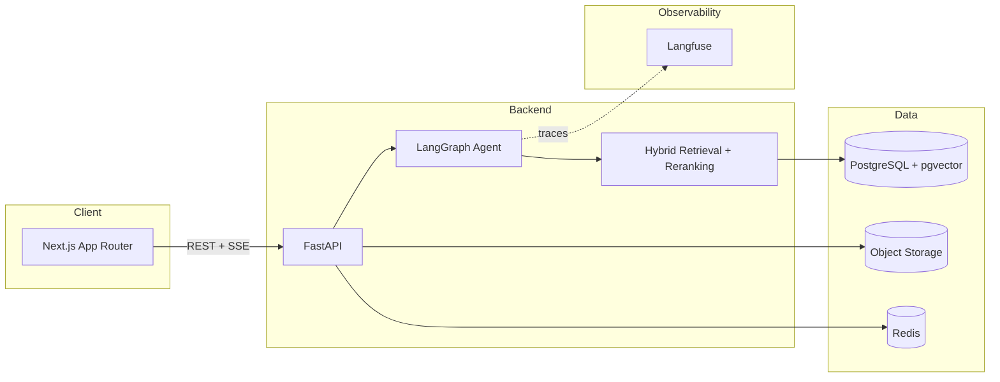

# ContractLens AI

An AI contract intelligence platform for legal, compliance, procurement, and finance teams — upload contracts, ask citation-grounded questions, run risk analysis, and inspect every step the AI agent takes to produce an answer.

This is a portfolio project built to demonstrate production AI engineering practices: hybrid retrieval, an explicit-state LangGraph agent, citation grounding with abstention, evaluation/regression testing, and cost/latency observability — not just "chat with a PDF."

Built incrementally in phases; this README and `docs/` are updated as each phase lands. **Current status: Phase 10 (full run, fixes, final docs) complete — all 10 phases done.**

## Why this project exists

Enterprise contract review is a high-stakes, evidence-heavy domain: a wrong or unsupported answer is worse than no answer. The point of this project is to show how to build an LLM system that treats groundedness as a first-class constraint — every claim is traceable to a retrieved chunk, and the system abstains when it doesn't have enough evidence — while still being a real, deployable product (auth, multi-tenancy, migrations, CI, observability).

## Architecture (target state)



Full RAG and agent architecture diagrams land in `docs/rag.md` and `docs/agent.md` as those phases are implemented.

## What's implemented so far (Phase 1)

- **Monorepo**: `apps/web` (Next.js 15, App Router, TypeScript, Tailwind, shadcn/ui), `apps/api` (FastAPI, Python 3.12), `packages/shared`, `infrastructure/`, `evaluation/`, `docs/`.
- **Auth**: email/password registration and login, JWT bearer tokens, bcrypt password hashing, org-scoped users (multi-tenant from day one).
- **Database**: PostgreSQL with the `pgvector` extension enabled, SQLAlchemy async models, Alembic migrations (`organizations`, `users` so far).
- **API**: structured error responses (`{ error: { code, message, request_id } }`), request-ID middleware, structured JSON logging, `/api/health`, `/api/metrics` stub.
- **Frontend**: dashboard shell with sidebar navigation (Dashboard, Documents, Analysis, AI Assistant, Evaluations, Agent Runs, Settings), working login/register forms (React Hook Form + Zod), auth-gated routes, TanStack Query for server state.
- **Docker**: `docker compose up` starts Postgres (pgvector), Redis, the API, and the web app, with health checks.
- **Tests**: backend auth/health tests (pytest + httpx, isolated test database) — 6/6 passing.

## What's implemented so far (Phase 2)

- **Storage abstraction**: `StorageBackend` interface with `LocalStorageBackend` (dev, disk-backed) and `S3StorageBackend` (boto3, works against AWS S3 or any S3-compatible endpoint via `S3_ENDPOINT_URL`), selected by `STORAGE_BACKEND=local|s3`.
- **Document + chunk schema**: `documents` and `document_chunks` tables (soft-deletable documents; chunks carry `page`, `section`, `heading`, `chunk_type`, `token_count`, a pgvector `embedding` column with an HNSW cosine index, and a generated `tsvector` column with a GIN index for full-text search — both indexes exist now so Phase 3's hybrid retrieval needs no new migration).
- **Parsing**: PDF (`pypdf`), DOCX (`python-docx`), TXT extractors behind one `parse_document()` entry point, each raising a structured `DocumentProcessingError` on unreadable/empty input instead of crashing.
- **Document-aware chunking**: regex-based structure detection recognizes numbered (`8.2 Termination`) and labeled (`ARTICLE VIII - TERMINATION`) section headers, groups paragraphs under the nearest heading, splits over-long paragraphs on sentence boundaries (never mid-sentence), and merges trivially short fragments into their neighbor — every chunk carries page/section/heading, not a raw character offset. Tested directly (`tests/test_chunker.py`), independent of the API.
- **Embedding provider abstraction**: `EmbeddingProvider` interface; `MockEmbeddingProvider` (hashed bag-of-words, deterministic, dependency-free — meaningfully differentiates chunks by shared vocabulary so retrieval is exercisable in demo mode) and `OpenAIEmbeddingProvider`, selected by `EMBEDDING_PROVIDER`.
- **Processing pipeline**: upload → object storage → parse → chunk → embed → index, orchestrated as a background task (`FastAPI BackgroundTasks`) that transitions `Document.status` through `uploading → processing → parsing → chunking → embedding → indexing → completed|failed`, recording a user-facing `error_message` on failure rather than swallowing it.
- **API**: `POST/GET /api/documents`, `GET/DELETE /api/documents/{id}` — MIME allowlist, size-limit, and empty-file validation; every query scoped to the caller's `organization_id` (cross-org access returns 403, verified by test).
- **Frontend**: drag-and-drop upload (native DnD, no added dependency), a document table with live status polling (auto-refetches while any document is mid-pipeline, stops once terminal), delete action, and the dashboard's document count/recents now reflect real data instead of placeholders.
- **Tests**: 15/15 backend tests passing (auth + health from Phase 1, plus chunker unit tests and document API integration tests covering upload validation, the full pipeline reaching `completed`, org-scoping, and soft delete).

## What's implemented so far (Phase 3)

- **Hybrid retrieval** (`app/retrieval/`): pgvector cosine similarity (HNSW-indexed) for semantic search + PostgreSQL full-text search (GIN-indexed `tsvector`, `websearch_to_tsquery`/`ts_rank`) for keyword search, combined with **Reciprocal Rank Fusion** — chosen over blending raw scores because cosine similarity and `ts_rank` live on incomparable scales; RRF only needs rank order.
- **Reranker abstraction** (`app/services/reranking/`): `Reranker` interface; `MockReranker` (lexical-overlap heuristic, deterministic, no API key) and `CohereReranker` (real cross-encoder via Cohere's REST API), selected by `RERANKER_PROVIDER`.
- **LLM provider abstraction** (`app/services/llm/`): `LLMProvider` interface; `MockLLMProvider` (deterministic — extracts and cites the top retrieved evidence block, so citation validation is exercisable without an API key) and `OpenAILLMProvider`, selected by `LLM_PROVIDER`.
- **Citation grounding** (`app/services/citations.py`): every generated answer is built from a numbered evidence block; `validate_citations()` strips any citation marker the model produced that doesn't map to an actually-retrieved chunk before the answer ever reaches the caller — a citation that wasn't retrieved from the database cannot appear.
- **Abstention**: `answer_query()` (`app/services/rag_service.py`) checks the reranked evidence score against `EVIDENCE_THRESHOLD` *before* calling the LLM, and abstains (fixed message, no fabrication) if evidence is insufficient — and abstains again afterward if the model's answer ends up with zero valid citations, rather than showing an unsupported claim.
- **Prompt versioning**: prompts live in `prompts/<task>/<version>.txt` (not inline strings), loaded via `app/core/prompts.py`; the QA prompt (`prompts/qa/v1.txt`) explicitly separates system instructions from the untrusted evidence section — see the prompt-injection tests in `tests/test_prompt_injection.py`.
- **API**: `POST /api/search` — hybrid search scoped to the caller's organization (and optionally specific `document_ids`), returning ranked evidence chunks with per-stage scores (vector, keyword, fused, reranked).
- **Tests**: 30/30 backend tests passing — added citation validation unit tests, RRF fusion unit tests, retrieval integration tests (relevance, org-scoping, document filtering) run against the real pgvector/full-text indexes, RAG answer tests (grounded answer with citations, abstention on no evidence, abstention for an empty organization), and prompt-injection tests.

## What's implemented so far (Phase 4)

- **LangGraph agent** (`app/agents/graph.py`): nine explicit nodes — `classify_query → plan → retrieve → evaluate_evidence → (reason | abstain) → validate_claims → validate_citations → final_response` — with a real conditional edge on evidence sufficiency, not a linear chain. Typed `AgentState` threaded through every node. See `docs/agent.md` for the full diagram and rationale.
- **Agent tools** (`app/agents/tools/`): `search_documents`, `get_clause`, `get_document_metadata`, `calculate` (AST-parsed, never `eval`), `retrieve_source`, `compare_clauses` — each with typed Pydantic input/output, a 10s timeout, structured logging, and org-scoped queries so a tool call can never read another organization's data.
- **Persistence + tracing**: every run creates an `AgentRun` + one `AgentStep` per graph node, plus a `Conversation`/`Message` pair — powering both the AI Assistant's chat history and the Agent Runs trace viewer from the same underlying data.
- **API**: `POST /api/chat` (SSE — streams `run_started` → `step` × N → `done`/`error` as the graph executes), `GET/{id} /api/conversations`, `GET/{id} /api/agent-runs`.
- **Frontend**: a real AI Assistant page — streaming responses with a live step indicator, inline citation markers, source list per answer, document scoping, conversation history, regenerate, copy, clear. A real Agent Runs page — run list plus a detail view with expandable steps (input/output/latency per node), matching the spec's trace UI.
- **Tests**: 44/44 backend tests passing — added agent graph tests (grounded answer, abstention, intent classification, tool-call recording), tool tests (calculate safety against code-injection attempts, unknown-tool/invalid-input error handling), and chat API tests (SSE event sequence, conversation persistence, agent-run creation, org-scoping).

## What's implemented so far (Phase 5)

- **Risk analysis** (`app/services/risk_analysis_service.py`): for each of 12 fixed clause categories (termination, payment terms, renewal, liability, indemnification, confidentiality, governing law, dispute resolution, data protection, audit rights, penalties, SLA obligations), retrieves document-scoped evidence via the Phase 3 hybrid search, generates a one/two-sentence summary through the LLM abstraction, and runs it through the same `validate_citations()` guardrail the chat agent uses. A category with no evidence above `EVIDENCE_THRESHOLD`, or whose generated summary ends up with zero valid citations, produces **no finding at all** — never a guessed one. Severity (high/medium/low) is a keyword heuristic over the retrieved evidence text (documented as a simplification, not a learned risk model — see `docs/analysis.md`). An overall 0–100 risk score rolls up the found severities.
- **Document comparison** (`app/services/comparison_service.py`): compares two documents across the same 12 categories by retrieving the top matching chunk for each category *independently per document* (semantic search, not exact section-number matching, since two contracts number sections differently) and showing both side by side. Deliberately **no LLM summarization** in the comparison itself — the displayed text is literally the retrieved evidence, so there's no risk of the comparison inventing a difference that isn't in the source text.
- **API**: `POST /api/documents/{id}/analyze` (background job, same status-polling pattern as document processing), `GET /api/documents/{id}/analysis`, `POST /api/comparisons`.
- **Frontend**: the real Analysis page — a Risk Analysis tab (document picker, risk-score gauge, findings grouped by severity with expandable citations) and a Compare Documents tab (two-document picker, side-by-side comparison table).
- **Tests**: 52/52 backend tests passing — added risk analysis tests (evidence-backed findings only, unlimited-liability correctly flagged high severity, no fabricated findings for categories absent from the source text, org-scoping) and comparison tests (both sides populated with citations, rejects comparing a document to itself, org-scoping).

"Unusual clauses" (listed in the product spec) is **not implemented** — flagging a clause as unusual requires outlier detection across a corpus (this clause's embedding is far from typical clauses of its kind), a different technique from the fixed-category keyword search used for the other 12 categories, and is a natural but separate future addition.

## What's implemented so far (Phase 6)

- **Seed data + demo corpus** (`evaluation/seed_documents/*.txt`): four synthetic contracts (MSA, NDA, DPA, Software License), each with realistic numbered sections, that give both the evaluation dataset and the demo app a stable corpus to run against. `apps/api/scripts/seed_demo_data.py` is idempotent (matches on filename, safe to re-run on every `docker compose up`) — it creates a demo org + user (`demo@contractlens-demo.com`) and pushes all four files through the *real* document pipeline (`document_service.process_document()`), not a DB fixture. `docker-compose.yml` mounts `./evaluation:/evaluation:ro` into the API container so both the seed files and the eval dataset are available there.
- **Evaluation dataset** (`evaluation/datasets/qa_eval_v1.json`): 52 hand-written cases (`EvalCase`: id, document_filename, category, question, expected_answer, expected_sources) across 13 substantive categories plus a dedicated `abstention` category (3 cases with `expected_sources: []` — deliberately unanswerable from the seed docs, so the harness can check the agent declines rather than fabricates).
- **Evaluation runner** (`app/services/evaluation_service.py`, `app/evaluation/dataset.py`, `app/evaluation/metrics.py`): `POST /api/evaluations/run` runs every case through the **real LangGraph agent** (`run_agent()` — the same function `/api/chat` calls, not a separate eval-only path), scoped to the seed document each case targets, and scores it: retrieval recall/precision (retrieved sections vs. `expected_sources`), citation accuracy (cited sections vs. expected), faithfulness (fraction of answer sentences carrying a citation marker — see below), answer relevance (Jaccard token overlap against `expected_answer`), a `hallucinated` flag (answered confidently but shouldn't have, or cited nothing correct), and a `passed` flag (abstention cases pass iff the agent abstained; normal cases pass iff it didn't abstain and cited at least one correct section). Latency, input/output tokens, and estimated cost are pulled straight off the `AgentRun` each case produces.
- **A real bug caught by the eval's own test suite**: `faithfulness_score()` (`app/evaluation/metrics.py`) originally mis-scored answers because citation markers trail their sentence ("claim. [1]"), which a naive `.split()` glues to the front of the *next* fragment — a failing unit test caught this, and the fix re-attaches leading markers to the previous sentence before scoring.
- **Regression detection**: each run looks up the most recent prior `COMPLETED` run for the same org + dataset version as a baseline (`EvaluationRun.baseline_run_id`) and flags any metric that moved the wrong direction by more than `REGRESSION_THRESHOLD` (default 0.03 = 3 points) into a `regressions` JSONB list (`{metric, baseline, current, delta}`) — higher-is-better for faithfulness/citation_accuracy/retrieval_recall/retrieval_precision/answer_relevance, lower-is-better for hallucination_rate.
- **DB**: two new tables, `evaluation_runs` (aggregates + regressions) and `evaluation_results` (one row per case, linked to the `AgentRun` it produced), migrated via Alembic — see `app/models/evaluation_run.py` / `evaluation_result.py`.
- **Cost tracking** (`app/services/cost.py`): a small explicit per-model pricing table (`estimate_cost()` — mock is $0.00, gpt-4o-mini/gpt-4o carry approximate real per-1K-token rates). Wired onto `AgentRun` (`estimated_cost_usd`, `model`, `input_tokens`, `output_tokens`) — every chat and evaluation run now records real token counts and an estimated dollar cost, not just latency.
- **Observability** (`app/observability/`): an `ObservabilityClient` abstraction with two implementations — `StructuredLogObservability` (default; logs a structured `agent_trace` event with model/tokens/cost/latency/step-count through the existing structlog setup, so tracing works out of the box with zero configuration) and `LangfuseObservability` (auto-selected when `LANGFUSE_PUBLIC_KEY`/`LANGFUSE_SECRET_KEY` are set; every call is wrapped in `try/except` so a Langfuse outage or SDK error can never break an agent run). See the trade-offs section below for the scope decision on self-hosting Langfuse.
- **Reranker fix** (`app/services/reranking/mock.py`): the Phase 3 mock reranker was scoring raw token overlap including English stopwords and contract boilerplate ("agreement", "party", "shall"), which meant a query sharing only connector words with a document could clear the evidence threshold by accident and undermine abstention. Now filters a stopword/boilerplate list before scoring overlap — found because the new abstention eval cases were actually failing, not by inspection.
- **API**: `POST /api/evaluations/run` (kicks off a background run), `GET /api/evaluations`, `GET /api/evaluations/{id}` (aggregate + per-case detail) — schemas in `app/schemas/evaluation.py`.
- **Frontend**: an Evaluations page — a run list plus a detail view with stat cards (faithfulness, citation accuracy, retrieval recall/precision, hallucination rate, cost/latency), a regression banner when the latest run regressed against its baseline, and a per-case table linking each case to its underlying agent-run trace.
- **Tests**: 67/67 backend tests passing — added evaluation-service tests (dataset scoring, regression detection, org-scoping), metrics unit tests (faithfulness sentence-splitting including the leading-marker bug fix, lexical overlap), and cost-estimation tests. (One case, `test_evaluation_run_scores_the_full_dataset`, initially failed deterministically — not flakily — because the mock reranker's stopword list didn't cover "described," a generic contract cross-reference verb that gave one abstention case just enough lexical overlap to clear the evidence threshold; fixed by extending the stopword list, confirmed stable across repeated runs.)

## What's implemented so far (Phase 7)

- **Rate limiting**: Redis-backed fixed-window throttling (`app/core/rate_limit.py`) as global middleware, keyed by authenticated user id or (for login/register, where it matters most) client IP. Only applies to mutating requests (POST/PUT/PATCH/DELETE) — GET/HEAD/OPTIONS are exempt, since this app's UI relies on polling (document processing status, evaluation run status) that can legitimately fire dozens of GETs a minute under normal use; the real abuse surface is login brute-forcing and write spam. Same structured `{error: {code: "RATE_LIMITED", ...}}` shape as every other error, plus a `Retry-After` header. Fails open if Redis is unreachable (availability over strictness, documented as a deliberate trade-off in `docs/security.md`).
- **Upload content validation**: the client-supplied `Content-Type` header is no longer trusted at face value — `document_service._validate_file_content()` checks the file's actual magic bytes (PDF signature, DOCX/zip signature, valid UTF-8 for text) against its declared type before storing or processing it, rejecting a mislabeled/spoofed upload (e.g. binary content mislabeled as `text/plain`).
- **Audit logging**: a new `audit_logs` table + `app/services/audit_service.py` records who did what to which resource — `user.register`, `user.login`, `user.login_failed`, `document.upload`, `document.delete`, `document.analyze`, `comparison.create` — each with the acting user, resource, IP, and metadata. `GET /api/audit-logs` is the first role-gated endpoint in the app (admin-only; other org members get 403), surfaced in Settings for admins.
- **Frontend**: an admin-only Audit Log section on the Settings page (table of recent org activity, formatted actions/timestamps, generic metadata rendering).
- **Tests**: 84/84 backend tests passing — added audit-logging tests (every logged action, role-gating, org-scoping), upload-content-validation tests (spoofed PDF/DOCX/TXT rejected, genuine files accepted), and rate-limit tests against a real Redis instance (independent budgets per identifier, 429 shape, `/api/health` always exempt).
- **A real bug caught along the way, unrelated to the feature being built**: `apps/api/.gitignore`'s unanchored `storage/` pattern was matching *any* directory named `storage`, including the `app/services/storage/` source package (the local/S3 storage-backend abstraction from Phase 2) — not just the intended `apps/api/storage/` local upload directory. That package had been untracked by git since Phase 2; Docker builds never noticed because `COPY . .` copies from disk, not from git, but a fresh `git clone` would have been missing the storage backend entirely. Fixed by anchoring the pattern (`/storage/`) and committing the four previously-untracked files.

## What's implemented so far (Phase 8)

- **Production Docker**: `apps/api/Dockerfile` is now multi-stage (a build stage with the compiler toolchain, a slim runtime stage without it) and runs as a non-root user; both `apps/api/Dockerfile` and `apps/web/Dockerfile` have real `HEALTHCHECK` instructions (a new minimal `apps/web/app/api/health/route.ts` gives the web container something to check, since the Next.js standalone server has no built-in health route). `docker-entrypoint.sh` only enables `uvicorn --reload` when `ENV=local` — a production container never watches the filesystem for changes. `docker-compose.prod.yml` is a standard Compose *override* (used as `docker compose -f docker-compose.yml -f docker-compose.prod.yml up -d --build`, not a replacement) that drops the dev bind-mount, sets `ENV=production`, and stops publishing Postgres/Redis ports to the host — verified live: all four services reported `healthy`, `--reload` was confirmed off via the startup log line, and the container ran as a non-root user, all checked against the real stack rather than assumed.
- **A real, previously-invisible bug found and fixed**: no Alembic migration ever ran `CREATE EXTENSION vector` — local dev only worked because the `pgvector/pgvector:pg16` Docker image happens to enable it during `initdb`. A vanilla Postgres instance (like RDS) would have failed on the first migration that adds a vector column. Fixed by adding `CREATE EXTENSION IF NOT EXISTS vector` to that migration directly, and **proved** the fix rather than trusting it: created a brand-new database with zero extensions, ran the full migration chain (`c2a78ee...` through `b29dc39...`) against it from nothing, and confirmed both the `vector` extension and all 14 tables existed afterward.
- **Terraform AWS infrastructure** (`infrastructure/terraform/`, 15 files): VPC with public/app/data subnets across 2 AZs, ECS Fargate cluster running the api and web images behind one path-routed ALB (`/api/*` → api target group, everything else → web), RDS Postgres 16 in private subnets, ElastiCache Redis, a private encrypted S3 bucket for documents (matching how `app/services/storage/s3.py` actually accesses it — server-side credentials + presigned URLs, not public access), CloudFront in front of the ALB (with `/api/*` explicitly bypassing cache since those routes are dynamic/authenticated/SSE), ECR repos, Secrets Manager for `SECRET_KEY`/DB credentials/LLM keys, and least-privilege IAM (the web service gets no AWS role at all; the api's task role is scoped to only its one S3 bucket). This is infrastructure-as-code demonstrating the deployment architecture, not a deployed environment — see the trade-offs below and `infrastructure/terraform/README.md` for the honest "what this doesn't do" list. `terraform fmt`, `terraform init -backend=false`, and `terraform validate` all pass clean.
- **CI/CD**: `.github/workflows/ci.yml` implements Lint → Type Check → Test → Build → Security Scan → Docker Build as a real job graph (not a flat list) with `needs:` dependencies, so Docker images only build after lint/tests/security scan pass — matching "production deployment should require passing tests." Every command in the pipeline was run and verified locally before being wired in, including a Postgres+Redis service-container setup for the backend test job matching how `tests/conftest.py` actually configures itself.
- **Frontend tests, from zero**: apps/web had no tests before this phase — a real gap against the project's own testing goals, not busywork padding. Added Vitest + React Testing Library (confirmed as this Next.js version's documented approach by reading `node_modules/next/dist/docs/` directly, per this repo's own `AGENTS.md` warning that this version has non-default conventions) with 20 tests covering citation-marker rendering (`FormattedAnswer` — the same class of attribution bug that was caught and fixed in the backend's `faithfulness_score`), the `apiFetch`/`ApiError` wrapper every API call goes through, and the risk-score severity-band boundaries (the off-by-one-prone kind of logic worth locking down).
- **Tests**: 84/84 backend + 20/20 new frontend tests passing.

## What's implemented so far (Phase 9)

No screenshot/browser tooling is available in this environment, so this phase is a code-level polish pass plus structural verification (curl for status codes/HTML markers, `docker exec` for container behavior) — not a visual review. Stated plainly rather than claimed as more than it is.

- **Dark mode, actually wired up.** `next-themes` was already an installed dependency and `components/ui/sonner.tsx` already called `useTheme()` — but there was no `ThemeProvider` anywhere, so it silently had no effect, and the full dark-mode CSS palette already sitting in `globals.css` (`.dark { ... }`) was unreachable no matter what the user's system theme was. Added a `ThemeProvider` (`attribute="class"`, system-aware) to the root layout, a toggle button in the topbar, and verified live: the anti-FOUC theme script is actually present in the served HTML, not just in the component tree.
- **Per-page browser tab titles.** Every route previously showed the same static "ContractLens AI" title. Rather than restructure all 12 client-component pages into server/client splits just to use the metadata API, the topbar's already-centralized route→title map now also drives `document.title` — one change point instead of twelve.
- **Branded 404 and error pages.** `app/not-found.tsx`, `app/error.tsx` (root-level, required to render its own `<html>`/`<body>` per Next.js convention since the root layout may itself have failed), and `app/(dashboard)/error.tsx` (nested, keeps the dashboard shell) replace Next's default unstyled fallbacks. Verified live: a nonexistent route returns a real 404 status with the custom page, not just custom markup on a 200.
- **Accessibility fixes on real gaps, not padding.** Four icon-only interactive elements had no accessible name (`aria-label`) — the assistant's send button, the copy-response button (which was also only reachable via hover, invisible to keyboard focus until `focus-visible:opacity-100` was added), the mobile nav trigger, and the per-document actions menu. Two disclosure-pattern buttons (agent-run step details, risk-finding details) gained `aria-expanded`. Checked and confirmed clean elsewhere: no hardcoded Tailwind color utility lacked a `dark:` counterpart, and the two existing shadcn dialog/sheet close buttons already had proper `sr-only` labels.
- **Tests, lint, and build unaffected**: 84/84 backend + 20/20 frontend tests still pass, ruff/tsc/eslint clean, `next build` succeeds (now emitting `/_not-found` and `/api/health` as expected additional routes).

## What's implemented so far (Phase 10)

Full run of everything, against the live Docker stack, not just unit tests — every feature exercised end-to-end with real HTTP calls after restarting the `api`/`web` containers fresh.

- **Full local verification, clean across the board**: 84/84 backend tests, ruff clean; `tsc --noEmit` clean, eslint clean, 20/20 frontend tests, `next build` succeeds (14 routes); `terraform validate` succeeds; `actionlint` on the CI workflow passes.
- **A real bug found and fixed by the live smoke test**: document upload returned a 500 (`PermissionError` writing to `/app/storage`). The `api_storage` named Docker volume on this dev machine predated Phase 8's Dockerfile change to a non-root container user — Docker doesn't retroactively re-chown an *existing* volume's contents when the image's owning user changes, so the volume was still root-owned while the container now runs as uid 999 (`app`). Fixed by `chown -R app:app` on the existing volume. Verified this is not a latent bug for anyone else: ran a fresh, never-before-used named volume against the built image and confirmed Docker correctly initializes it with `app:app` ownership (copied from the image layer) on first mount — the fix here was a one-time local-environment correction, not a code change.
- **End-to-end smoke test, live**: registered a new user/org, uploaded and processed a document, ran hybrid search, ran the full LangGraph chat agent (verified the SSE step sequence: `classify_query → plan → retrieve → reason → validate_claims → validate_citations → final_response`, with citations, cost, and per-step latency all populated), triggered abstention on an out-of-scope question (confidence `0.0`, `abstain` step present), ran risk analysis to completion, compared two documents, ran the evaluation harness against the seeded demo corpus (52 cases, faithfulness 1.0, meaningful non-trivial retrieval/citation metrics) and ran it a second time to confirm regression detection actually compares against the prior run (`baseline_run_id` correctly set, `regressions: []` since nothing changed), checked audit logs, and confirmed unauthenticated requests are rejected with 401. All 8 core dashboard routes served 200 from the running web container.
- **Definition of Done, reviewed item by item** against the original spec: every capability listed there — compose up, frontend, backend, migrations, upload, processing, RAG, hybrid retrieval, citations, abstention, the LangGraph agent, tools, risk analysis, comparison, agent traces, evaluations, regression tests, observability, cost tracking, latency tracking, auth, authorization, tests, lint, type checks, README, architecture docs — was checked live or via the test suite, not assumed. The one gap surfaced (storage permission) was fixed during this pass, not left for later.

## Why these technology choices

- **PostgreSQL + pgvector instead of a dedicated vector DB**: one database for relational data (documents, users, evaluations) and vectors means simpler transactions, backups, and ops — the trade-off (less specialized ANN performance at very large scale) is acceptable until proven otherwise. See `docs/rag.md`.
- **FastAPI + async SQLAlchemy**: native async fits an I/O-heavy workload (LLM calls, embeddings, object storage) without a separate worker model for the common case.
- **LangGraph over a plain chain**: contract Q&A needs conditional branching (enough evidence vs. abstain), explicit state, and inspectable steps for the Agent Runs UI — a linear chain can't express that. See `docs/agent.md`.
- **Provider-agnostic LLM/embedding/reranker abstractions**: `LLM_PROVIDER`, `EMBEDDING_PROVIDER`, `RERANKER_PROVIDER` env vars select the implementation; a `mock` provider powers demo mode so the app runs with zero API keys.
- **S3-compatible object storage, not DB blobs**: keeps Postgres small and fast; local disk backend for dev, S3 for production behind the same interface.

## Local setup

Requirements: Docker Desktop, Node 20+, Python 3.12 (only needed if you want to run the API outside Docker).

```bash
cp .env.example .env
docker compose up -d --build
```

This starts:

| Service   | URL                              |
|-----------|-----------------------------------|
| Web       | http://localhost:3000             |
| API       | http://localhost:8000            |
| API docs  | http://localhost:8000/docs       |
| Postgres  | localhost:5433 (mapped from container port 5432) |
| Redis     | localhost:6379                   |

> Postgres is remapped to 5433 in `docker-compose.yml` to avoid colliding with a locally-installed Postgres on the default 5432. Adjust freely for your machine.

### Running a production-shaped stack locally

```bash
docker compose -f docker-compose.yml -f docker-compose.prod.yml up -d --build
```

This is the standard Compose override pattern — `docker-compose.prod.yml` (see the file itself for the full annotated diff) drops the live-reload source bind-mount, sets `ENV=production` so the API starts without `--reload`, stops publishing Postgres/Redis ports to the host, and tightens the restart policy. Verified locally: all four services report `healthy`, `docker exec contractlens-api whoami` returns a non-root `app` user, and both `/api/health` (API) and `/api/health` (web, via a small `apps/web/app/api/health/route.ts`) respond 200.

Demo mode is on by default (`LLM_PROVIDER=mock` etc. in `.env.example`) — the app is fully usable without any API keys. Set real provider keys in `.env` to use live models once later phases add LLM calls.

### Running the API outside Docker

```bash
cd apps/api
python3.12 -m venv .venv && source .venv/bin/activate
pip install -r requirements-dev.txt
cp ../../.env .env   # adjust DATABASE_URL port if needed
alembic upgrade head
uvicorn app.main:app --reload
```

### Running the web app outside Docker

```bash
cd apps/web
npm install
npm run dev
```

## Environment variables

See `.env.example` for the full list (database, storage, LLM/embedding/reranker provider selection, Langfuse, cost/latency budgets, rate limiting).

## Testing

```bash
make test-api      # backend: pytest — 84 tests (auth, documents, retrieval, agent, risk analysis, evaluation, security)
make lint-api       # ruff
make typecheck-web  # tsc --noEmit
make lint-web       # eslint
cd apps/web && npm test   # frontend: vitest — 20 tests (citation rendering, API client, risk scoring)
```

`.github/workflows/ci.yml` runs all of the above (plus a security scan and a Docker build) as a real job graph on every PR and push to `main` — see the "CI/CD" section below.

## CI/CD

GitHub Actions (`.github/workflows/ci.yml`) implements `Lint → Type Check → Test → Build → Security Scan → Docker Build` as dependent jobs, not a flat list — the Docker build jobs `needs:` the lint/test/security jobs, so a broken pipeline can't produce an image. The backend test job spins up real Postgres (`pgvector/pgvector:pg16`, matching local dev exactly) and Redis service containers rather than mocking either. Every command in the workflow was run and confirmed passing locally before being wired in — see the Phase 8 trade-offs below for the two places coverage is intentionally incomplete (backend type-checking, Python dependency security scanning) and why.

## Deployment

`infrastructure/terraform/` contains Terraform for the target AWS architecture (VPC, ECS Fargate for both services behind one path-routed ALB, RDS Postgres, ElastiCache Redis, S3 for documents, CloudFront, ECR, Secrets Manager, least-privilege IAM) — see `infrastructure/terraform/README.md` for the deploy sequence and an explicit "what this doesn't do" list. This is infrastructure-as-code demonstrating the deployment architecture (passes `terraform fmt`/`validate` cleanly); it has not been applied against a real AWS account since none is available in this environment — see the trade-offs section.

## Trade-offs (so far)

- **Phase 9's "polish" is code-level only — no visual/browser testing was performed.** There is no screenshot or browser-automation tool in this environment, so claims are limited to what can be verified structurally: HTTP status codes, served HTML content, container health, `tsc`/`eslint`/`next build`/test results. Layout/spacing/visual-contrast issues that only show up when actually looking at rendered pixels would not have been caught.
- **Per-page titles are set via `document.title` in a `useEffect`, not the Next.js metadata API.** All 12 routes are client components (they need hooks for auth/data-fetching), and the metadata API requires a server component. Restructuring every page into a server-wrapper + client-view split just to set a `<title>` was judged not worth the churn versus one centralized `document.title` effect in the topbar (and a matching one in the auth shell) — noted here because it's a conscious trade-off, not an oversight; a page that needs real per-route `<meta>` tags for SEO/social-sharing (this app is behind auth, so that's not a current need) would need the proper split.
- **Auth guard on the frontend is still client-side** (`useEffect` redirect), not fixed in Phase 7 as originally sketched — it turns out to need a bigger change than "add middleware.ts": Next.js middleware runs at the edge and can only see cookies/headers, not `localStorage`, and this app stores the JWT in `localStorage`. A real fix means switching to an httpOnly cookie-based session, which is a legitimate Phase 7-adjacent security improvement but a bigger architectural change than the rest of this phase — left open rather than half-done.
- **Background processing via `FastAPI BackgroundTasks`, not a real task queue.** This runs in-process and is lost if the API process restarts mid-job — acceptable for an MVP where processing takes seconds, but Redis is already in the stack specifically so this can move to a proper queue (RQ/Celery/arq) without changing the pipeline logic itself, which is already isolated in `document_service.process_document()`.
- **Terraform has not been applied against a real AWS account.** No AWS credentials are available in this environment, so "correct, well-organized IaC that passes `terraform validate`" is the honest bar here, not "proven to deploy." `terraform fmt`/`init -backend=false`/`validate` all pass, and the resource graph was reviewed carefully, but there is no substitute for a real `terraform apply` — treat this as a strong, reviewable starting point, not a battle-tested module. The S3 backend for remote state is also left commented out with setup instructions rather than configured, since there's no bucket to point it at.
- **CI security scanning is informational for Python deps, blocking for JS deps.** `npm audit --audit-level=high` fails the build (0 vulnerabilities currently — a real gate). `pip-audit` runs with `continue-on-error: true` because it has no severity filter and currently reports ~60 advisories against pinned transitive dependencies (langgraph, starlette, urllib3, pypdf, etc.) — blocking on all of those today would redden CI for issues unrelated to this app's own code, most of which don't have a newer compatible pin available yet. Worth tightening once there's a process for triaging and either upgrading or explicitly accepting individual findings.
- **No `typecheck-backend` CI job.** `mypy` is listed in `requirements-dev.txt` but was never actually configured (no `mypy.ini`, no `[tool.mypy]` section) — running it as-is throws 32 pre-existing errors against code that was never written with mypy in mind. Rather than either silently skip type-checking or block CI on a wall of unrelated errors, the gap is left explicit: backend type-adjacent coverage currently comes from `ruff` only, noted directly in the workflow file rather than hidden.
- **Chunking is regex-heuristic, not ML-based structure detection.** It handles common contract heading styles (`8.2 Termination`, `ARTICLE VIII - TERMINATION`) but will miss unusual formatting. Documented as a known limitation rather than overclaiming a general-purpose document parser.
- **DOCX has no real page numbers** (Word doesn't store fixed page boundaries in the XML without rendering), so DOCX chunks have `page: null`. PDF and the future PDF-viewer-based citation UI (Phase 3) rely on real page numbers, which PDF provides natively.
- The mock embedding provider (hashed bag-of-words) is good enough to exercise retrieval end-to-end in demo mode but is **not semantically meaningful** — it will not understand synonyms or paraphrase, unlike a real embedding model.
- **The mock reranker is lexical (exact token overlap), not semantic.** In demo mode this means a query can occasionally rank a short heading chunk (e.g. "8.2 Termination") above the fuller clause below it if the heading happens to share more literal words with the query — a real cross-encoder reranker (Cohere) resolves this correctly. Documented rather than hidden because it's a real, observable behavior in demo mode, not a bug in the pipeline logic.
- **`POST /api/search` returns evidence only, not a generated answer** — `POST /api/chat` (the LangGraph agent) is the endpoint that generates grounded answers; `/api/search` remains a thin retrieval-only endpoint for cases that just need ranked evidence.
- **Tool selection is heuristic, not LLM function-calling.** `plan()` decides which tools to call via keyword/regex on the query, not by asking the model — the mock LLM has no reasoning to select tools with, and `OpenAILLMProvider` doesn't implement function-calling yet. Confined to one function (`app/agents/nodes.py::plan`), so swapping in a real planner later doesn't touch the rest of the graph.
- **`validate_claims` is a heuristic faithfulness check** (does every sentence carry a citation marker?), not a semantic entailment check — it records a warning in the agent trace rather than blocking the response. The hard citation gate is `validate_citations`, which is mechanical and enforced.
- **SSE streaming is step-level, not token-level.** The client sees "Searching documents… Generating answer…" as each graph node completes, but the `reason` step's own LLM call is not streamed token-by-token — `LLMProvider.complete()` is currently a single non-streaming call.
- **Risk severity is a keyword heuristic, not a learned risk model.** `classify_severity()` scans retrieved evidence text for escalating/mitigating keywords per category (e.g. "unlimited"/"uncapped" → high liability risk, "capped at" → low). It works well on clearly-worded clauses (verified by test: unlimited liability language is correctly flagged high) but won't catch risk expressed in unusual phrasing a keyword list doesn't anticipate.
- **On very small/sparse documents, risk analysis can surface weak matches for categories the document doesn't actually address.** With only a handful of chunks in a short document and `EVIDENCE_THRESHOLD=0.15`, categories with no real content can still clear the bar via loose lexical overlap (observed directly on a 5-chunk demo NDA: "payment terms" and "SLA obligations" both surfaced low-confidence findings pointing at unrelated clauses). Every such finding still carries a real citation — the "never fabricate" guarantee holds — but the confidence score is genuinely low (published in the finding), and this is expected to improve significantly on real, multi-page contracts where categories that aren't addressed simply return no chunks above threshold.
- **Comparison shows raw retrieved text, not a normalized value.** The spec's example table shows compact values ("30 days" vs "7 days"); the implementation shows the full retrieved clause instead, by design — normalizing "30 days written notice" down to "30 days" is exactly the kind of lossy summarization step that risks silently dropping a qualifier, and showing the source text keeps the comparison as trustworthy as the retrieval underneath it.
- **`answer_relevance` and `faithfulness` in the eval harness are lexical heuristics, not an LLM-as-judge.** `answer_relevance` is Jaccard token overlap between the generated answer and the case's `expected_answer`; `faithfulness` is the fraction of answer sentences carrying a citation marker (the same heuristic `validate_claims` already uses, made numeric). A real judge model would score meaning, not word overlap — not implemented because demo mode's mock LLM has nothing for a judge to meaningfully evaluate, and adding an LLM-as-judge call is real future work, not a rounding error.
- **Self-hosted Langfuse is not stood up in `docker-compose.yml`.** Self-hosted Langfuse (v3) needs its own ClickHouse, MinIO, Redis, and Postgres — too heavy for what it would add here, especially since the Agent Runs UI (Phase 4) already serves as a purpose-built trace viewer for this app. `LangfuseObservability` supports Langfuse Cloud's free tier (just set `LANGFUSE_PUBLIC_KEY`/`LANGFUSE_SECRET_KEY`) or a self-hosted instance run separately (`LANGFUSE_HOST` is configurable); the default `StructuredLogObservability` requires no external service at all. Stated here as a deliberate scope decision, not an oversight.
- **A Docker named volume doesn't get re-chowned when the image's container user changes.** `docker-entrypoint.sh`/the Dockerfile correctly create `/app/storage` as `app:app` at build time, and a genuinely fresh `api_storage` volume inherits that ownership correctly on first mount (verified directly). But an *existing* volume created before Phase 8 switched the container to run as non-root keeps its old (root) ownership forever, since Docker only initializes a volume's contents once. This bit a long-running local dev environment in Phase 10 and was fixed with a one-time `chown` — worth knowing if a production deploy ever reuses a volume/EBS snapshot created under an older image.
- **`AgentRun.input_tokens`/`output_tokens` existed as columns since Phase 4 but were never actually populated until Phase 6** — a real gap in the original agent-run persistence code, found while wiring up cost tracking, not a new feature being added from scratch. Worth flagging because it's the kind of bug that's easy to miss (the columns existed, so nothing looked obviously incomplete) until something downstream (cost estimation) needed the data to be real.

## Roadmap

- [x] Phase 1 — Monorepo, auth, basic UI, Docker
- [x] Phase 2 — Document upload, storage, processing pipeline, chunking, embeddings, pgvector indexing
- [x] Phase 3 — Hybrid retrieval, reranking, citations, RAG
- [x] Phase 4 — LangGraph agent, tools, guardrails, abstention
- [x] Phase 5 — Risk analysis, document comparison
- [x] Phase 6 — Observability (Langfuse), evaluation framework, regression testing
- [x] Phase 7 — Security hardening, rate limiting, audit logs
- [x] Phase 8 — Production Docker, CI/CD, Terraform/AWS
- [x] Phase 9 — UI polish
- [x] Phase 10 — Full run, fixes, final docs

## Documentation

- [`docs/architecture.md`](docs/architecture.md)
- [`docs/rag.md`](docs/rag.md)
- [`docs/agent.md`](docs/agent.md)
- [`docs/analysis.md`](docs/analysis.md)
- [`docs/evaluation.md`](docs/evaluation.md)
- [`docs/security.md`](docs/security.md)
