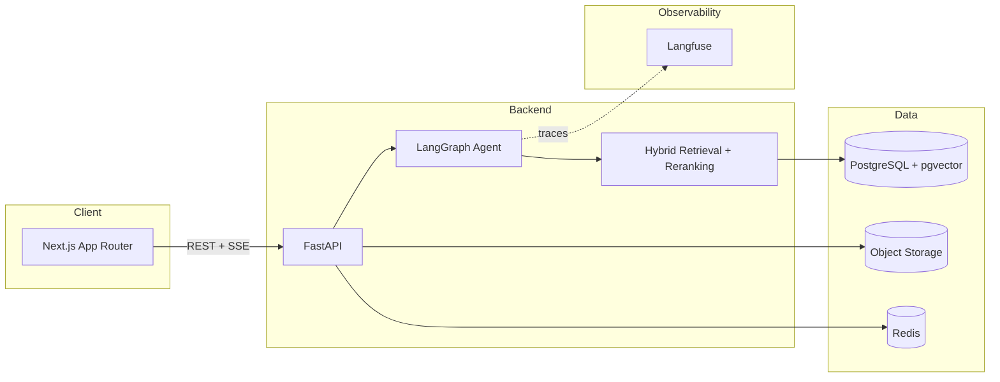

# ContractLens AI

An AI contract intelligence platform for legal, compliance, procurement, and finance teams — upload contracts, ask citation-grounded questions, run risk analysis, and inspect every step the AI agent takes to produce an answer.

This is a portfolio project built to demonstrate production AI engineering practices: hybrid retrieval, an explicit-state LangGraph agent, citation grounding with abstention, evaluation/regression testing, and cost/latency observability — not just "chat with a PDF."

Built incrementally in phases; this README and `docs/` are updated as each phase lands. **Current status: Phase 5 (risk analysis, document comparison) complete.**

## Why this project exists

Enterprise contract review is a high-stakes, evidence-heavy domain: a wrong or unsupported answer is worse than no answer. The point of this project is to show how to build an LLM system that treats groundedness as a first-class constraint — every claim is traceable to a retrieved chunk, and the system abstains when it doesn't have enough evidence — while still being a real, deployable product (auth, multi-tenancy, migrations, CI, observability).

## Architecture (target state)



Full RAG and agent architecture diagrams land in `docs/rag.md` and `docs/agent.md` as those phases are implemented.

## What's implemented so far (Phase 1)

- **Monorepo**: `apps/web` (Next.js 15, App Router, TypeScript, Tailwind, shadcn/ui), `apps/api` (FastAPI, Python 3.12), `packages/shared`, `infrastructure/`, `evaluation/`, `docs/`.
- **Auth**: email/password registration and login, JWT bearer tokens, bcrypt password hashing, org-scoped users (multi-tenant from day one).
- **Database**: PostgreSQL with the `pgvector` extension enabled, SQLAlchemy async models, Alembic migrations (`organizations`, `users` so far).
- **API**: structured error responses (`{ error: { code, message, request_id } }`), request-ID middleware, structured JSON logging, `/api/health`, `/api/metrics` stub.
- **Frontend**: dashboard shell with sidebar navigation (Dashboard, Documents, Analysis, AI Assistant, Evaluations, Agent Runs, Settings), working login/register forms (React Hook Form + Zod), auth-gated routes, TanStack Query for server state.
- **Docker**: `docker compose up` starts Postgres (pgvector), Redis, the API, and the web app, with health checks.
- **Tests**: backend auth/health tests (pytest + httpx, isolated test database) — 6/6 passing.

## What's implemented so far (Phase 2)

- **Storage abstraction**: `StorageBackend` interface with `LocalStorageBackend` (dev, disk-backed) and `S3StorageBackend` (boto3, works against AWS S3 or any S3-compatible endpoint via `S3_ENDPOINT_URL`), selected by `STORAGE_BACKEND=local|s3`.
- **Document + chunk schema**: `documents` and `document_chunks` tables (soft-deletable documents; chunks carry `page`, `section`, `heading`, `chunk_type`, `token_count`, a pgvector `embedding` column with an HNSW cosine index, and a generated `tsvector` column with a GIN index for full-text search — both indexes exist now so Phase 3's hybrid retrieval needs no new migration).
- **Parsing**: PDF (`pypdf`), DOCX (`python-docx`), TXT extractors behind one `parse_document()` entry point, each raising a structured `DocumentProcessingError` on unreadable/empty input instead of crashing.
- **Document-aware chunking**: regex-based structure detection recognizes numbered (`8.2 Termination`) and labeled (`ARTICLE VIII - TERMINATION`) section headers, groups paragraphs under the nearest heading, splits over-long paragraphs on sentence boundaries (never mid-sentence), and merges trivially short fragments into their neighbor — every chunk carries page/section/heading, not a raw character offset. Tested directly (`tests/test_chunker.py`), independent of the API.
- **Embedding provider abstraction**: `EmbeddingProvider` interface; `MockEmbeddingProvider` (hashed bag-of-words, deterministic, dependency-free — meaningfully differentiates chunks by shared vocabulary so retrieval is exercisable in demo mode) and `OpenAIEmbeddingProvider`, selected by `EMBEDDING_PROVIDER`.
- **Processing pipeline**: upload → object storage → parse → chunk → embed → index, orchestrated as a background task (`FastAPI BackgroundTasks`) that transitions `Document.status` through `uploading → processing → parsing → chunking → embedding → indexing → completed|failed`, recording a user-facing `error_message` on failure rather than swallowing it.
- **API**: `POST/GET /api/documents`, `GET/DELETE /api/documents/{id}` — MIME allowlist, size-limit, and empty-file validation; every query scoped to the caller's `organization_id` (cross-org access returns 403, verified by test).
- **Frontend**: drag-and-drop upload (native DnD, no added dependency), a document table with live status polling (auto-refetches while any document is mid-pipeline, stops once terminal), delete action, and the dashboard's document count/recents now reflect real data instead of placeholders.
- **Tests**: 15/15 backend tests passing (auth + health from Phase 1, plus chunker unit tests and document API integration tests covering upload validation, the full pipeline reaching `completed`, org-scoping, and soft delete).

## What's implemented so far (Phase 3)

- **Hybrid retrieval** (`app/retrieval/`): pgvector cosine similarity (HNSW-indexed) for semantic search + PostgreSQL full-text search (GIN-indexed `tsvector`, `websearch_to_tsquery`/`ts_rank`) for keyword search, combined with **Reciprocal Rank Fusion** — chosen over blending raw scores because cosine similarity and `ts_rank` live on incomparable scales; RRF only needs rank order.
- **Reranker abstraction** (`app/services/reranking/`): `Reranker` interface; `MockReranker` (lexical-overlap heuristic, deterministic, no API key) and `CohereReranker` (real cross-encoder via Cohere's REST API), selected by `RERANKER_PROVIDER`.
- **LLM provider abstraction** (`app/services/llm/`): `LLMProvider` interface; `MockLLMProvider` (deterministic — extracts and cites the top retrieved evidence block, so citation validation is exercisable without an API key) and `OpenAILLMProvider`, selected by `LLM_PROVIDER`.
- **Citation grounding** (`app/services/citations.py`): every generated answer is built from a numbered evidence block; `validate_citations()` strips any citation marker the model produced that doesn't map to an actually-retrieved chunk before the answer ever reaches the caller — a citation that wasn't retrieved from the database cannot appear.
- **Abstention**: `answer_query()` (`app/services/rag_service.py`) checks the reranked evidence score against `EVIDENCE_THRESHOLD` *before* calling the LLM, and abstains (fixed message, no fabrication) if evidence is insufficient — and abstains again afterward if the model's answer ends up with zero valid citations, rather than showing an unsupported claim.
- **Prompt versioning**: prompts live in `prompts/<task>/<version>.txt` (not inline strings), loaded via `app/core/prompts.py`; the QA prompt (`prompts/qa/v1.txt`) explicitly separates system instructions from the untrusted evidence section — see the prompt-injection tests in `tests/test_prompt_injection.py`.
- **API**: `POST /api/search` — hybrid search scoped to the caller's organization (and optionally specific `document_ids`), returning ranked evidence chunks with per-stage scores (vector, keyword, fused, reranked).
- **Tests**: 30/30 backend tests passing — added citation validation unit tests, RRF fusion unit tests, retrieval integration tests (relevance, org-scoping, document filtering) run against the real pgvector/full-text indexes, RAG answer tests (grounded answer with citations, abstention on no evidence, abstention for an empty organization), and prompt-injection tests.

## What's implemented so far (Phase 4)

- **LangGraph agent** (`app/agents/graph.py`): nine explicit nodes — `classify_query → plan → retrieve → evaluate_evidence → (reason | abstain) → validate_claims → validate_citations → final_response` — with a real conditional edge on evidence sufficiency, not a linear chain. Typed `AgentState` threaded through every node. See `docs/agent.md` for the full diagram and rationale.
- **Agent tools** (`app/agents/tools/`): `search_documents`, `get_clause`, `get_document_metadata`, `calculate` (AST-parsed, never `eval`), `retrieve_source`, `compare_clauses` — each with typed Pydantic input/output, a 10s timeout, structured logging, and org-scoped queries so a tool call can never read another organization's data.
- **Persistence + tracing**: every run creates an `AgentRun` + one `AgentStep` per graph node, plus a `Conversation`/`Message` pair — powering both the AI Assistant's chat history and the Agent Runs trace viewer from the same underlying data.
- **API**: `POST /api/chat` (SSE — streams `run_started` → `step` × N → `done`/`error` as the graph executes), `GET/{id} /api/conversations`, `GET/{id} /api/agent-runs`.
- **Frontend**: a real AI Assistant page — streaming responses with a live step indicator, inline citation markers, source list per answer, document scoping, conversation history, regenerate, copy, clear. A real Agent Runs page — run list plus a detail view with expandable steps (input/output/latency per node), matching the spec's trace UI.
- **Tests**: 44/44 backend tests passing — added agent graph tests (grounded answer, abstention, intent classification, tool-call recording), tool tests (calculate safety against code-injection attempts, unknown-tool/invalid-input error handling), and chat API tests (SSE event sequence, conversation persistence, agent-run creation, org-scoping).

## What's implemented so far (Phase 5)

- **Risk analysis** (`app/services/risk_analysis_service.py`): for each of 12 fixed clause categories (termination, payment terms, renewal, liability, indemnification, confidentiality, governing law, dispute resolution, data protection, audit rights, penalties, SLA obligations), retrieves document-scoped evidence via the Phase 3 hybrid search, generates a one/two-sentence summary through the LLM abstraction, and runs it through the same `validate_citations()` guardrail the chat agent uses. A category with no evidence above `EVIDENCE_THRESHOLD`, or whose generated summary ends up with zero valid citations, produces **no finding at all** — never a guessed one. Severity (high/medium/low) is a keyword heuristic over the retrieved evidence text (documented as a simplification, not a learned risk model — see `docs/analysis.md`). An overall 0–100 risk score rolls up the found severities.
- **Document comparison** (`app/services/comparison_service.py`): compares two documents across the same 12 categories by retrieving the top matching chunk for each category *independently per document* (semantic search, not exact section-number matching, since two contracts number sections differently) and showing both side by side. Deliberately **no LLM summarization** in the comparison itself — the displayed text is literally the retrieved evidence, so there's no risk of the comparison inventing a difference that isn't in the source text.
- **API**: `POST /api/documents/{id}/analyze` (background job, same status-polling pattern as document processing), `GET /api/documents/{id}/analysis`, `POST /api/comparisons`.
- **Frontend**: the real Analysis page — a Risk Analysis tab (document picker, risk-score gauge, findings grouped by severity with expandable citations) and a Compare Documents tab (two-document picker, side-by-side comparison table).
- **Tests**: 52/52 backend tests passing — added risk analysis tests (evidence-backed findings only, unlimited-liability correctly flagged high severity, no fabricated findings for categories absent from the source text, org-scoping) and comparison tests (both sides populated with citations, rejects comparing a document to itself, org-scoping).

"Unusual clauses" (listed in the product spec) is **not implemented** — flagging a clause as unusual requires outlier detection across a corpus (this clause's embedding is far from typical clauses of its kind), a different technique from the fixed-category keyword search used for the other 12 categories, and is a natural but separate future addition.

Everything else described below (evaluations, observability) is **designed but not yet built** — this README states what's real vs. planned so it stays trustworthy as the project grows.

## Why these technology choices

- **PostgreSQL + pgvector instead of a dedicated vector DB**: one database for relational data (documents, users, evaluations) and vectors means simpler transactions, backups, and ops — the trade-off (less specialized ANN performance at very large scale) is acceptable until proven otherwise. See `docs/rag.md`.
- **FastAPI + async SQLAlchemy**: native async fits an I/O-heavy workload (LLM calls, embeddings, object storage) without a separate worker model for the common case.
- **LangGraph over a plain chain**: contract Q&A needs conditional branching (enough evidence vs. abstain), explicit state, and inspectable steps for the Agent Runs UI — a linear chain can't express that. See `docs/agent.md`.
- **Provider-agnostic LLM/embedding/reranker abstractions**: `LLM_PROVIDER`, `EMBEDDING_PROVIDER`, `RERANKER_PROVIDER` env vars select the implementation; a `mock` provider powers demo mode so the app runs with zero API keys.
- **S3-compatible object storage, not DB blobs**: keeps Postgres small and fast; local disk backend for dev, S3 for production behind the same interface.

## Local setup

Requirements: Docker Desktop, Node 20+, Python 3.12 (only needed if you want to run the API outside Docker).

```bash
cp .env.example .env
docker compose up -d --build
```

This starts:

| Service   | URL                              |
|-----------|-----------------------------------|
| Web       | http://localhost:3002 (mapped from container port 3000 — see note below) |
| API       | http://localhost:8000            |
| API docs  | http://localhost:8000/docs       |
| Postgres  | localhost:5433 (mapped from container port 5432) |
| Redis     | localhost:6379                   |

> The Postgres and web ports are remapped (5433, 3002) in `docker-compose.yml` to avoid colliding with other local services on the default ports. Adjust freely for your machine.

Demo mode is on by default (`LLM_PROVIDER=mock` etc. in `.env.example`) — the app is fully usable without any API keys. Set real provider keys in `.env` to use live models once later phases add LLM calls.

### Running the API outside Docker

```bash
cd apps/api
python3.12 -m venv .venv && source .venv/bin/activate
pip install -r requirements-dev.txt
cp ../../.env .env   # adjust DATABASE_URL port if needed
alembic upgrade head
uvicorn app.main:app --reload
```

### Running the web app outside Docker

```bash
cd apps/web
npm install
npm run dev
```

## Environment variables

See `.env.example` for the full list (database, storage, LLM/embedding/reranker provider selection, Langfuse, cost/latency budgets, rate limiting).

## Testing

```bash
make test-api      # backend: pytest (auth, health — more added each phase)
make lint-api       # ruff
make typecheck-web  # tsc --noEmit
make lint-web       # eslint
```

## Trade-offs (so far)

- Auth guard on the frontend is client-side (`useEffect` redirect) for now; a middleware-based redirect is a Phase 7 (security hardening) item so unauthenticated users never see even a flash of protected UI.
- **Background processing via `FastAPI BackgroundTasks`, not a real task queue.** This runs in-process and is lost if the API process restarts mid-job — acceptable for an MVP where processing takes seconds, but Redis is already in the stack specifically so this can move to a proper queue (RQ/Celery/arq) without changing the pipeline logic itself, which is already isolated in `document_service.process_document()`.
- **Chunking is regex-heuristic, not ML-based structure detection.** It handles common contract heading styles (`8.2 Termination`, `ARTICLE VIII - TERMINATION`) but will miss unusual formatting. Documented as a known limitation rather than overclaiming a general-purpose document parser.
- **DOCX has no real page numbers** (Word doesn't store fixed page boundaries in the XML without rendering), so DOCX chunks have `page: null`. PDF and the future PDF-viewer-based citation UI (Phase 3) rely on real page numbers, which PDF provides natively.
- The mock embedding provider (hashed bag-of-words) is good enough to exercise retrieval end-to-end in demo mode but is **not semantically meaningful** — it will not understand synonyms or paraphrase, unlike a real embedding model.
- **The mock reranker is lexical (exact token overlap), not semantic.** In demo mode this means a query can occasionally rank a short heading chunk (e.g. "8.2 Termination") above the fuller clause below it if the heading happens to share more literal words with the query — a real cross-encoder reranker (Cohere) resolves this correctly. Documented rather than hidden because it's a real, observable behavior in demo mode, not a bug in the pipeline logic.
- **`POST /api/search` returns evidence only, not a generated answer** — `POST /api/chat` (the LangGraph agent) is the endpoint that generates grounded answers; `/api/search` remains a thin retrieval-only endpoint for cases that just need ranked evidence.
- **Tool selection is heuristic, not LLM function-calling.** `plan()` decides which tools to call via keyword/regex on the query, not by asking the model — the mock LLM has no reasoning to select tools with, and `OpenAILLMProvider` doesn't implement function-calling yet. Confined to one function (`app/agents/nodes.py::plan`), so swapping in a real planner later doesn't touch the rest of the graph.
- **`validate_claims` is a heuristic faithfulness check** (does every sentence carry a citation marker?), not a semantic entailment check — it records a warning in the agent trace rather than blocking the response. The hard citation gate is `validate_citations`, which is mechanical and enforced.
- **SSE streaming is step-level, not token-level.** The client sees "Searching documents… Generating answer…" as each graph node completes, but the `reason` step's own LLM call is not streamed token-by-token — `LLMProvider.complete()` is currently a single non-streaming call.
- **Risk severity is a keyword heuristic, not a learned risk model.** `classify_severity()` scans retrieved evidence text for escalating/mitigating keywords per category (e.g. "unlimited"/"uncapped" → high liability risk, "capped at" → low). It works well on clearly-worded clauses (verified by test: unlimited liability language is correctly flagged high) but won't catch risk expressed in unusual phrasing a keyword list doesn't anticipate.
- **On very small/sparse documents, risk analysis can surface weak matches for categories the document doesn't actually address.** With only a handful of chunks in a short document and `EVIDENCE_THRESHOLD=0.15`, categories with no real content can still clear the bar via loose lexical overlap (observed directly on a 5-chunk demo NDA: "payment terms" and "SLA obligations" both surfaced low-confidence findings pointing at unrelated clauses). Every such finding still carries a real citation — the "never fabricate" guarantee holds — but the confidence score is genuinely low (published in the finding), and this is expected to improve significantly on real, multi-page contracts where categories that aren't addressed simply return no chunks above threshold.
- **Comparison shows raw retrieved text, not a normalized value.** The spec's example table shows compact values ("30 days" vs "7 days"); the implementation shows the full retrieved clause instead, by design — normalizing "30 days written notice" down to "30 days" is exactly the kind of lossy summarization step that risks silently dropping a qualifier, and showing the source text keeps the comparison as trustworthy as the retrieval underneath it.

## Roadmap

- [x] Phase 1 — Monorepo, auth, basic UI, Docker
- [x] Phase 2 — Document upload, storage, processing pipeline, chunking, embeddings, pgvector indexing
- [x] Phase 3 — Hybrid retrieval, reranking, citations, RAG
- [x] Phase 4 — LangGraph agent, tools, guardrails, abstention
- [x] Phase 5 — Risk analysis, document comparison
- [ ] Phase 6 — Observability (Langfuse), evaluation framework, regression testing
- [ ] Phase 7 — Security hardening, rate limiting, audit logs
- [ ] Phase 8 — Production Docker, CI/CD, Terraform/AWS
- [ ] Phase 9 — UI polish
- [ ] Phase 10 — Full run, fixes, final docs

## Documentation

- [`docs/architecture.md`](docs/architecture.md)
- [`docs/rag.md`](docs/rag.md)
- [`docs/agent.md`](docs/agent.md)
- [`docs/analysis.md`](docs/analysis.md)
- [`docs/evaluation.md`](docs/evaluation.md)
- [`docs/security.md`](docs/security.md)
