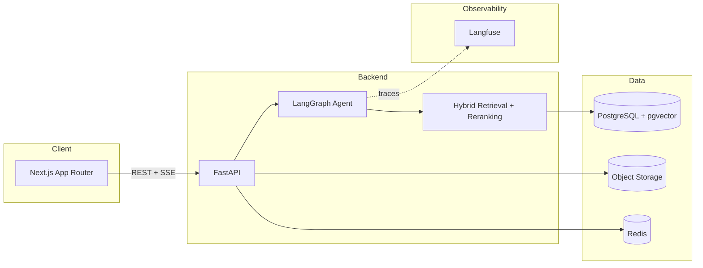

# ContractLens AI

An AI contract intelligence platform for legal, compliance, procurement, and finance teams — upload contracts, ask citation-grounded questions, run risk analysis, and inspect every step the AI agent takes to produce an answer.

This is a portfolio project built to demonstrate production AI engineering practices: hybrid retrieval, an explicit-state LangGraph agent, citation grounding with abstention, evaluation/regression testing, and cost/latency observability — not just "chat with a PDF."

Built incrementally in phases; this README and `docs/` are updated as each phase lands. **Current status: Phase 2 (document upload & processing) complete.**

## Why this project exists

Enterprise contract review is a high-stakes, evidence-heavy domain: a wrong or unsupported answer is worse than no answer. The point of this project is to show how to build an LLM system that treats groundedness as a first-class constraint — every claim is traceable to a retrieved chunk, and the system abstains when it doesn't have enough evidence — while still being a real, deployable product (auth, multi-tenancy, migrations, CI, observability).

## Architecture (target state)



Full RAG and agent architecture diagrams land in `docs/rag.md` and `docs/agent.md` as those phases are implemented.

## What's implemented so far (Phase 1)

- **Monorepo**: `apps/web` (Next.js 15, App Router, TypeScript, Tailwind, shadcn/ui), `apps/api` (FastAPI, Python 3.12), `packages/shared`, `infrastructure/`, `evaluation/`, `docs/`.
- **Auth**: email/password registration and login, JWT bearer tokens, bcrypt password hashing, org-scoped users (multi-tenant from day one).
- **Database**: PostgreSQL with the `pgvector` extension enabled, SQLAlchemy async models, Alembic migrations (`organizations`, `users` so far).
- **API**: structured error responses (`{ error: { code, message, request_id } }`), request-ID middleware, structured JSON logging, `/api/health`, `/api/metrics` stub.
- **Frontend**: dashboard shell with sidebar navigation (Dashboard, Documents, Analysis, AI Assistant, Evaluations, Agent Runs, Settings), working login/register forms (React Hook Form + Zod), auth-gated routes, TanStack Query for server state.
- **Docker**: `docker compose up` starts Postgres (pgvector), Redis, the API, and the web app, with health checks.
- **Tests**: backend auth/health tests (pytest + httpx, isolated test database) — 6/6 passing.

## What's implemented so far (Phase 2)

- **Storage abstraction**: `StorageBackend` interface with `LocalStorageBackend` (dev, disk-backed) and `S3StorageBackend` (boto3, works against AWS S3 or any S3-compatible endpoint via `S3_ENDPOINT_URL`), selected by `STORAGE_BACKEND=local|s3`.
- **Document + chunk schema**: `documents` and `document_chunks` tables (soft-deletable documents; chunks carry `page`, `section`, `heading`, `chunk_type`, `token_count`, a pgvector `embedding` column with an HNSW cosine index, and a generated `tsvector` column with a GIN index for full-text search — both indexes exist now so Phase 3's hybrid retrieval needs no new migration).
- **Parsing**: PDF (`pypdf`), DOCX (`python-docx`), TXT extractors behind one `parse_document()` entry point, each raising a structured `DocumentProcessingError` on unreadable/empty input instead of crashing.
- **Document-aware chunking**: regex-based structure detection recognizes numbered (`8.2 Termination`) and labeled (`ARTICLE VIII - TERMINATION`) section headers, groups paragraphs under the nearest heading, splits over-long paragraphs on sentence boundaries (never mid-sentence), and merges trivially short fragments into their neighbor — every chunk carries page/section/heading, not a raw character offset. Tested directly (`tests/test_chunker.py`), independent of the API.
- **Embedding provider abstraction**: `EmbeddingProvider` interface; `MockEmbeddingProvider` (hashed bag-of-words, deterministic, dependency-free — meaningfully differentiates chunks by shared vocabulary so retrieval is exercisable in demo mode) and `OpenAIEmbeddingProvider`, selected by `EMBEDDING_PROVIDER`.
- **Processing pipeline**: upload → object storage → parse → chunk → embed → index, orchestrated as a background task (`FastAPI BackgroundTasks`) that transitions `Document.status` through `uploading → processing → parsing → chunking → embedding → indexing → completed|failed`, recording a user-facing `error_message` on failure rather than swallowing it.
- **API**: `POST/GET /api/documents`, `GET/DELETE /api/documents/{id}` — MIME allowlist, size-limit, and empty-file validation; every query scoped to the caller's `organization_id` (cross-org access returns 403, verified by test).
- **Frontend**: drag-and-drop upload (native DnD, no added dependency), a document table with live status polling (auto-refetches while any document is mid-pipeline, stops once terminal), delete action, and the dashboard's document count/recents now reflect real data instead of placeholders.
- **Tests**: 15/15 backend tests passing (auth + health from Phase 1, plus chunker unit tests and document API integration tests covering upload validation, the full pipeline reaching `completed`, org-scoping, and soft delete).

Everything else described below (hybrid retrieval, the LangGraph agent, risk analysis, evaluations) is **designed but not yet built** — this README states what's real vs. planned so it stays trustworthy as the project grows.

## Why these technology choices

- **PostgreSQL + pgvector instead of a dedicated vector DB**: one database for relational data (documents, users, evaluations) and vectors means simpler transactions, backups, and ops — the trade-off (less specialized ANN performance at very large scale) is acceptable until proven otherwise. See `docs/rag.md`.
- **FastAPI + async SQLAlchemy**: native async fits an I/O-heavy workload (LLM calls, embeddings, object storage) without a separate worker model for the common case.
- **LangGraph over a plain chain**: contract Q&A needs conditional branching (enough evidence vs. abstain), explicit state, and inspectable steps for the Agent Runs UI — a linear chain can't express that. See `docs/agent.md`.
- **Provider-agnostic LLM/embedding/reranker abstractions**: `LLM_PROVIDER`, `EMBEDDING_PROVIDER`, `RERANKER_PROVIDER` env vars select the implementation; a `mock` provider powers demo mode so the app runs with zero API keys.
- **S3-compatible object storage, not DB blobs**: keeps Postgres small and fast; local disk backend for dev, S3 for production behind the same interface.

## Local setup

Requirements: Docker Desktop, Node 20+, Python 3.12 (only needed if you want to run the API outside Docker).

```bash
cp .env.example .env
docker compose up -d --build
```

This starts:

| Service   | URL                              |
|-----------|-----------------------------------|
| Web       | http://localhost:3002 (mapped from container port 3000 — see note below) |
| API       | http://localhost:8000            |
| API docs  | http://localhost:8000/docs       |
| Postgres  | localhost:5433 (mapped from container port 5432) |
| Redis     | localhost:6379                   |

> The Postgres and web ports are remapped (5433, 3002) in `docker-compose.yml` to avoid colliding with other local services on the default ports. Adjust freely for your machine.

Demo mode is on by default (`LLM_PROVIDER=mock` etc. in `.env.example`) — the app is fully usable without any API keys. Set real provider keys in `.env` to use live models once later phases add LLM calls.

### Running the API outside Docker

```bash
cd apps/api
python3.12 -m venv .venv && source .venv/bin/activate
pip install -r requirements-dev.txt
cp ../../.env .env   # adjust DATABASE_URL port if needed
alembic upgrade head
uvicorn app.main:app --reload
```

### Running the web app outside Docker

```bash
cd apps/web
npm install
npm run dev
```

## Environment variables

See `.env.example` for the full list (database, storage, LLM/embedding/reranker provider selection, Langfuse, cost/latency budgets, rate limiting).

## Testing

```bash
make test-api      # backend: pytest (auth, health — more added each phase)
make lint-api       # ruff
make typecheck-web  # tsc --noEmit
make lint-web       # eslint
```

## Trade-offs (so far)

- Auth guard on the frontend is client-side (`useEffect` redirect) for now; a middleware-based redirect is a Phase 7 (security hardening) item so unauthenticated users never see even a flash of protected UI.
- **Background processing via `FastAPI BackgroundTasks`, not a real task queue.** This runs in-process and is lost if the API process restarts mid-job — acceptable for an MVP where processing takes seconds, but Redis is already in the stack specifically so this can move to a proper queue (RQ/Celery/arq) without changing the pipeline logic itself, which is already isolated in `document_service.process_document()`.
- **Chunking is regex-heuristic, not ML-based structure detection.** It handles common contract heading styles (`8.2 Termination`, `ARTICLE VIII - TERMINATION`) but will miss unusual formatting. Documented as a known limitation rather than overclaiming a general-purpose document parser.
- **DOCX has no real page numbers** (Word doesn't store fixed page boundaries in the XML without rendering), so DOCX chunks have `page: null`. PDF and the future PDF-viewer-based citation UI (Phase 3) rely on real page numbers, which PDF provides natively.
- The mock embedding provider (hashed bag-of-words) is good enough to exercise retrieval end-to-end in demo mode but is **not semantically meaningful** — it will not understand synonyms or paraphrase, unlike a real embedding model.

## Roadmap

- [x] Phase 1 — Monorepo, auth, basic UI, Docker
- [x] Phase 2 — Document upload, storage, processing pipeline, chunking, embeddings, pgvector indexing
- [ ] Phase 3 — Hybrid retrieval, reranking, citations, RAG
- [ ] Phase 4 — LangGraph agent, tools, guardrails, abstention
- [ ] Phase 5 — Risk analysis, document comparison
- [ ] Phase 6 — Observability (Langfuse), evaluation framework, regression testing
- [ ] Phase 7 — Security hardening, rate limiting, audit logs
- [ ] Phase 8 — Production Docker, CI/CD, Terraform/AWS
- [ ] Phase 9 — UI polish
- [ ] Phase 10 — Full run, fixes, final docs

## Documentation

- [`docs/architecture.md`](docs/architecture.md)
- [`docs/rag.md`](docs/rag.md)
- [`docs/agent.md`](docs/agent.md)
- [`docs/evaluation.md`](docs/evaluation.md)
- [`docs/security.md`](docs/security.md)
