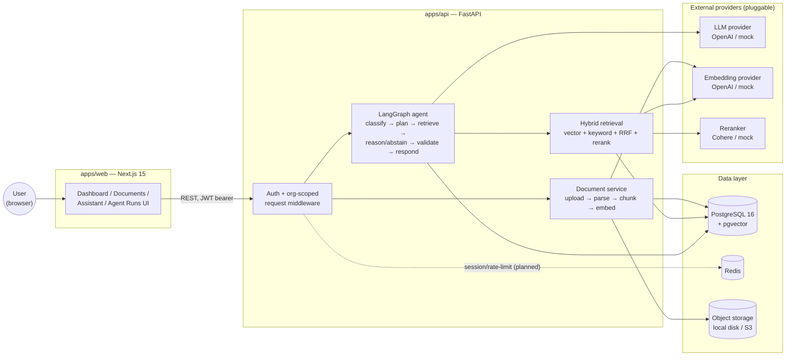
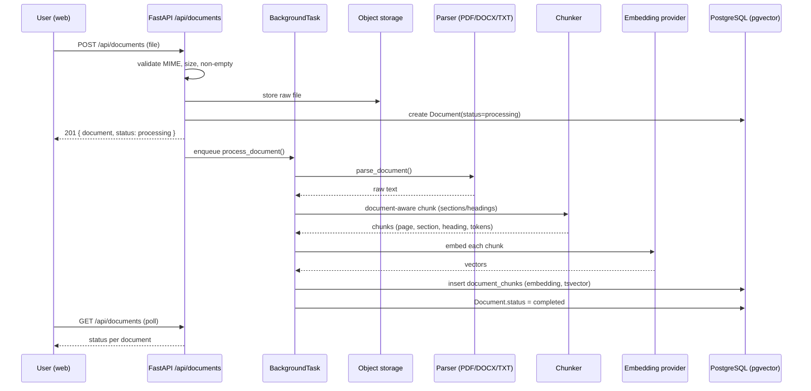
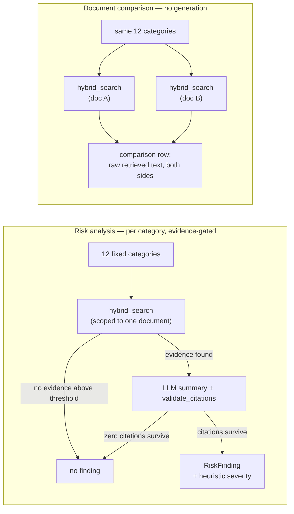
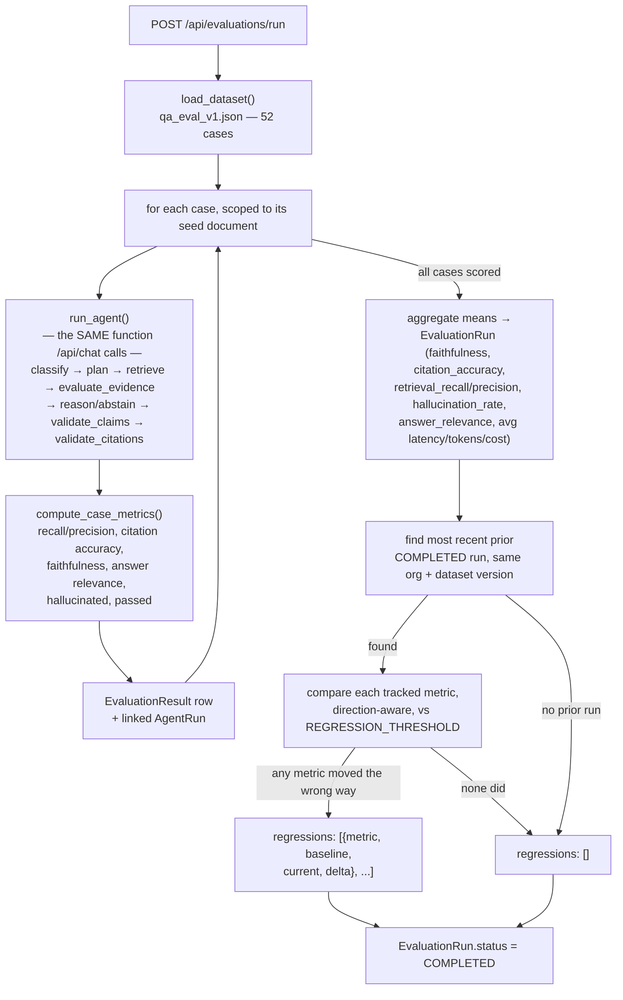
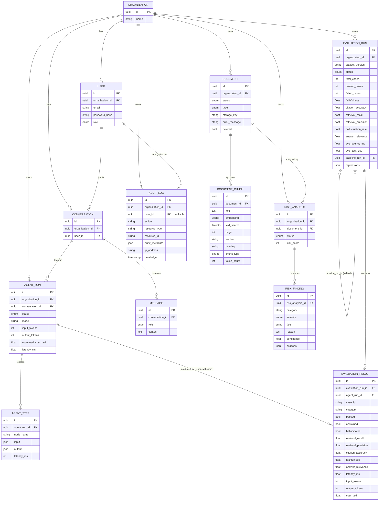
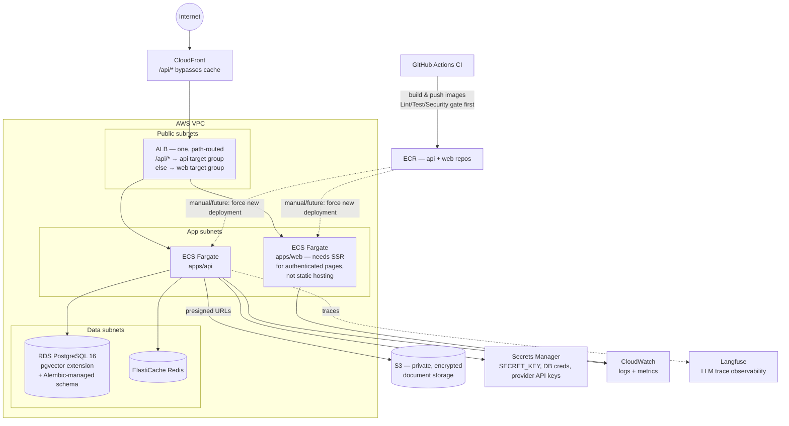

# Architecture

> Status: reflects Phase 1–8 (auth, document pipeline, hybrid RAG, LangGraph agent, risk analysis, document comparison, evaluation harness + regression testing, cost/observability tracking, security hardening, production Docker + CI/CD + Terraform AWS infrastructure). The cloud architecture (§12) is implemented as Terraform but not deployed against a real AWS account — see that section for exactly what "implemented" means here. See the roadmap in the root [README](../README.md).

## 1. System overview

ContractLens AI is a monorepo with two independently deployable applications that communicate over HTTP only — no shared runtime, no shared database access from the frontend.

- **`apps/web`** — Next.js 15 (App Router, TypeScript, Tailwind, shadcn/ui, TanStack Query). Renders the dashboard, documents, risk analysis/comparison, AI assistant, agent-run trace viewer, evaluations, and settings screens.
- **`apps/api`** — FastAPI (Python 3.12, async SQLAlchemy). Owns all business logic, persistence, retrieval, and AI orchestration (LangGraph agent).

This split keeps the two deployable independently (web on a static/edge host, API on a container host) and keeps every sensitive operation — document access control, LLM calls, retrieval — server-side.



## 2. Why a monorepo, two apps

A single repo simplifies coordinated changes (e.g., a new API field and the UI that renders it) without cross-repo versioning overhead, while `apps/web` and `apps/api` remain independently buildable, testable, and deployable — there is no runtime coupling between them.

## 3. Backend layering

```
apps/api/app/
├── api/v1/        # HTTP layer: routers (auth, documents, search, chat, conversations, agent_runs, comparisons, evaluations, audit_logs, health)
├── core/          # config, security, logging, structured errors, middleware, rate_limit
├── db/            # session factory, declarative base, Alembic migrations
├── models/        # SQLAlchemy ORM models (see §8 data model)
├── schemas/       # Pydantic request/response schemas
├── services/      # business logic: auth, document_service, rag_service, agent_service, risk_analysis_service, comparison_service, audit_service, citations, embeddings, reranking, llm
├── retrieval/     # hybrid retrieval pipeline: vector_search, keyword_search, fusion (RRF)
├── agents/        # LangGraph agent: graph.py, nodes.py, state.py, tools/
├── evaluation/    # eval dataset loader + metrics (dataset.py, metrics.py)
└── observability/ # ObservabilityClient: structured-log (default) + Langfuse
```

Routers depend on services; services depend on models/db — never the reverse. Pydantic schemas are the only types that cross the API boundary; ORM models are never serialized directly.

## 4. Document processing flow



`Document.status` moves through `uploading → processing → parsing → chunking → embedding → indexing → completed | failed` (with a stored `error_message` on failure), which the frontend polls to render live progress. Runs today as an in-process `FastAPI BackgroundTask` — Redis is already in the stack so this can move to a real queue (RQ/Celery/arq) without changing `document_service.process_document()` itself.

## 5. RAG + agent query flow

Query answering is implemented as an explicit-state LangGraph agent (`apps/api/app/agents/graph.py`), not a linear prompt chain, so evidence-sufficiency is a real branch and every step is independently inspectable for the Agent Runs UI.


Each node's input/output, latency, and token usage is recorded as an `AgentStep` row against an `AgentRun`, which is what the `/agent-runs/[id]` trace viewer renders — retrieval, reranking, evidence gating, generation, and citation validation are all visible steps, not a black box.

**Hybrid retrieval** (`app/retrieval/`): pgvector HNSW cosine similarity (semantic) + PostgreSQL full-text search (GIN-indexed `tsvector`, keyword) fused with Reciprocal Rank Fusion (scores live on incomparable scales, so RRF uses rank order only), then reranked by a cross-encoder (`RERANKER_PROVIDER=cohere|mock`).

**Citation grounding**: every answer is built from a numbered evidence block; `validate_citations()` strips any citation marker the model produced that doesn't map to an actually-retrieved chunk before the response reaches the caller.

**Abstention**: the evidence-score gate runs *before* the LLM call (cheaper, faster, removes any chance of rationalizing from weak evidence) and again *after* generation if zero citations survive validation.

## 6. Risk analysis + document comparison flow

Both reuse the same retrieval + citation-validation primitives as chat rather than a separate pipeline:



`app/services/risk_analysis_service.py` runs as a background task per `POST /api/documents/{id}/analyze`, identical in shape to `document_service.process_document()` (its own DB session, polled status). `app/services/comparison_service.py` runs synchronously within `POST /api/comparisons` since it's pure retrieval with no LLM call — see `docs/analysis.md` for why comparison deliberately skips generation.

## 7. Evaluation flow

`POST /api/evaluations/run` (`app/services/evaluation_service.py::run_evaluation`) runs as a background task, identical in shape to document processing and risk analysis: create a `RUNNING` row, do the work with its own DB session, land on `COMPLETED` or `FAILED`. What's different is that "the work" is running the entire agent graph from §5 once per dataset case, not a single pipeline pass.



Each case reuses the real chat pipeline (`run_agent()`) rather than a lighter-weight direct-retrieval check, and produces a real, independently-inspectable `AgentRun` — a failing eval case can be opened in the Agent Runs trace viewer, not just read as a number. See `docs/evaluation.md` for the full metric definitions and the rationale behind reusing the agent, comparing against the most recent run rather than a fixed baseline, and treating `answer_relevance`/`faithfulness` as lexical heuristics for now rather than an LLM-as-judge.

Cost and latency are captured as a side effect of every agent run, not just eval runs: `app/services/cost.py::estimate_cost()` (a small explicit per-model pricing table) is applied to every `AgentRun`'s `input_tokens`/`output_tokens`, and `app/observability/` (`StructuredLogObservability` by default, `LangfuseObservability` when `LANGFUSE_PUBLIC_KEY`/`LANGFUSE_SECRET_KEY` are set) records a trace of model/tokens/cost/latency/step-count for every run, chat or eval alike — see `docs/evaluation.md` for the Langfuse self-hosting scope decision.

## 8. Data model



PostgreSQL is used exclusively through async SQLAlchemy sessions with Alembic-managed migrations. The `vector` extension was enabled from the first migration, before any vector columns existed, so later phases could add `document_chunks.embedding` (HNSW index) and a generated `tsvector`/GIN column without a separate extension-enabling migration. See §8 (rationale) below and `docs/rag.md` for the full case for PostgreSQL+pgvector over a dedicated vector database.

## 9. Multi-tenancy and auth

Every user belongs to an `Organization`. JWTs (HS256, bcrypt-hashed passwords) carry both `sub` (user id) and `org_id`; every authenticated request resolves the current user server-side, and every query for tenant-owned resources (documents, chunks, conversations, agent runs, evaluations, audit logs) filters by `organization_id` — no user can address another org's data by ID alone (verified by tests). `UserRole` (admin/member/viewer) adds a second axis on top of org-scoping, so far used by exactly one endpoint (`GET /api/audit-logs`, admin-only). Rate limiting, audit logging, and upload content validation (Phase 7) are documented in full in `docs/security.md`.

## 10. Provider abstractions

`LLM_PROVIDER`, `EMBEDDING_PROVIDER`, and `RERANKER_PROVIDER` environment variables select between a real provider (OpenAI, Cohere) and a deterministic `mock` implementation, so the full pipeline — upload, retrieval, generation, citation validation, abstention — is exercisable end-to-end with zero API keys (demo mode). Swapping a provider is a config change, not a code change, because each is implemented behind a common interface (`services/llm/`, `services/embeddings/`, `services/reranking/`).

## 11. Local development topology

`docker-compose.yml` runs four services with health checks:

| Service    | Image / build              | Local port | Role                                  |
|------------|-----------------------------|------------|----------------------------------------|
| `postgres` | `pgvector/pgvector:pg16`   | 5433→5432  | Relational + vector store              |
| `redis`    | `redis:7-alpine`           | 6379       | Rate-limit counters (`app/core/rate_limit.py`), reserved for a real task queue |
| `api`      | `apps/api/Dockerfile`      | 8000       | FastAPI, source volume-mounted (`--reload`) |
| `web`      | `apps/web/Dockerfile`      | 3000       | Next.js                                |

This matches the shape of the target production deployment below without requiring cloud credentials for local work. `docker-compose.prod.yml` (Phase 8) is a Compose override for running a production-shaped stack locally — no source bind-mount, `ENV=production` (disables `--reload`), Postgres/Redis no longer published to the host — see the README's "Running a production-shaped stack locally" section.

## 12. Cloud architecture (Phase 8 — implemented as Terraform, not deployed)

`infrastructure/terraform/` (15 files, organized by concern — see `infrastructure/terraform/README.md`) implements the architecture below as real HCL: VPC with public/app/data subnets across 2 AZs, ECS Fargate running both the api and web images behind **one** ALB with path-based routing (`/api/*` → api target group, everything else → web — cheaper and simpler than two ALBs at this scale), RDS Postgres 16 in private subnets, ElastiCache Redis, a private encrypted S3 bucket, CloudFront in front of the ALB, ECR repos, Secrets Manager, and least-privilege IAM (the web service gets no AWS role at all; the api's task role is scoped to only its one S3 bucket, nothing broader). `terraform fmt`, `terraform init -backend=false`, and `terraform validate` all pass with zero errors and zero warnings.

**What this is not**: applied against a real AWS account. There are no AWS credentials in this environment, so the bar met here is "correct, internally-consistent, reviewable infrastructure-as-code," not "proven via `terraform apply`." The remote-state S3 backend is deliberately left commented out with setup instructions rather than pointed at a real bucket that doesn't exist. Treat this as a strong, reviewable starting point — see `infrastructure/terraform/README.md`'s explicit "what this doesn't do" section (no CI-driven auto-apply, no multi-region/DR, no WAF, no cost estimate) for the full honest list.



Design intent:

- **`apps/web` runs as its own ECS Fargate service, not a static/edge host.** The obvious-looking alternative (S3 + CloudFront, no containers) doesn't fit this app: it has authenticated, dynamic pages (dashboard, documents, chat) that need server-side rendering per-request, not a build-time-static export. CloudFront still sits in front, but as a cache/edge layer over the ALB, not a static-file origin.
- **One ALB, not two.** Path-based routing (`/api/*` → api target group, everything else → web) is the standard pattern for "a few services behind one load balancer" and is cheaper and simpler than provisioning a second ALB at this scale.
- **`apps/api`** deploys as containers on ECS Fargate behind the ALB, in app subnets with no direct internet ingress — the non-root, health-checked, multi-stage production image built in this same phase (see `apps/api/Dockerfile`) is what these tasks would actually run.
- **RDS PostgreSQL 16** replaces the local `pgvector/pgvector:pg16` container. The pgvector extension is enabled by the app's own migration chain (`CREATE EXTENSION IF NOT EXISTS vector` in the first migration that adds a vector column — a real gap found and fixed in this phase, verified by running the full chain against a brand-new database), so this is not a manual RDS setup step; `alembic upgrade head` is sufficient on a vanilla Postgres 15+ instance.
- **ElastiCache Redis** replaces the local Redis container, backing the rate limiter (`app/core/rate_limit.py`, implemented in Phase 7) and reserved for a future real task queue.
- **S3** replaces the local disk `StorageBackend` — the code path is already provider-agnostic (`STORAGE_BACKEND=local|s3`), so this is a config change, not a rewrite. The Terraform bucket is private and encrypted, matching how `app/services/storage/s3.py` actually accesses it (server-side credentials + presigned URLs — never public).
- **Secrets Manager** holds `SECRET_KEY`, DB credentials, and LLM/embedding/reranker provider API keys — never baked into images or committed to the repo.
- **IAM is least-privilege**: the web service has no AWS role at all (it doesn't need one — all AWS access goes through the API); the api's task role is scoped to only its own S3 bucket.
- **CI/CD** (`.github/workflows/ci.yml`, Phase 8) builds and validates both images on every PR/push; pushing to ECR and forcing a new ECS deployment is the natural next step but is not wired up yet — there's no registry to push to without a real AWS account, so this stays a documented manual/future step rather than a workflow that would fail on every run.
- **Langfuse** receives LLM/agent traces (cost, latency, token usage per node) — the `LangfuseObservability` integration exists as of Phase 6 (see §7); it points at Langfuse Cloud or a separately-run instance via `LANGFUSE_HOST`, not infrastructure this repo's Terraform stands up.

## 13. Trade-offs and known limitations

See the root [README](../README.md#trade-offs-so-far) for the current, maintained list (background processing via in-process `BackgroundTasks` rather than a queue, regex-heuristic chunking, mock embedding/reranker semantics, client-side auth guard, etc.) — kept in one place to avoid this document drifting out of sync with it.

## 14. Related documents

- [`docs/rag.md`](rag.md) — retrieval, chunking, and citation design rationale
- [`docs/agent.md`](agent.md) — LangGraph agent design rationale
- [`docs/security.md`](security.md) — auth and authorization model
- [`docs/evaluation.md`](evaluation.md) — evaluation dataset, metrics, and regression-detection rationale
- [`docs/analysis.md`](analysis.md) — risk analysis and document comparison design rationale
- [`infrastructure/terraform/README.md`](../infrastructure/terraform/README.md) — Terraform deploy sequence and explicit "what this doesn't do" list
