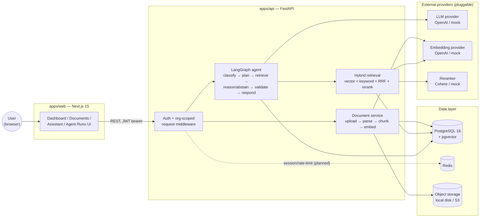
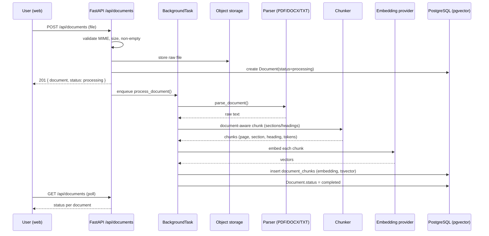
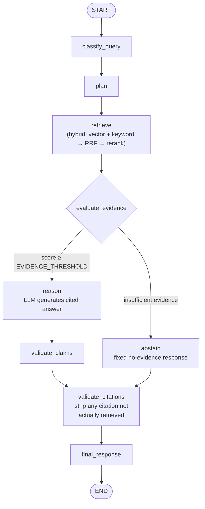
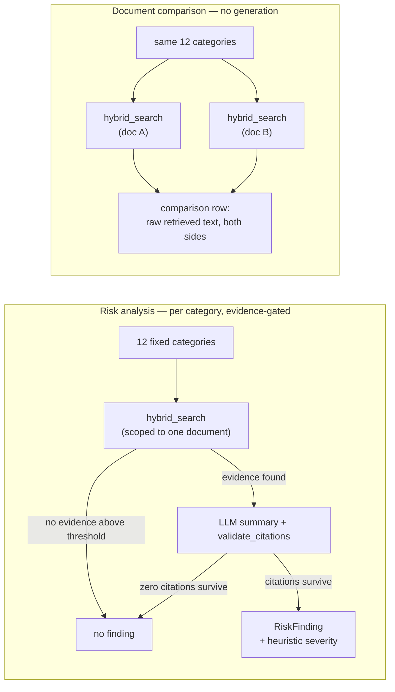
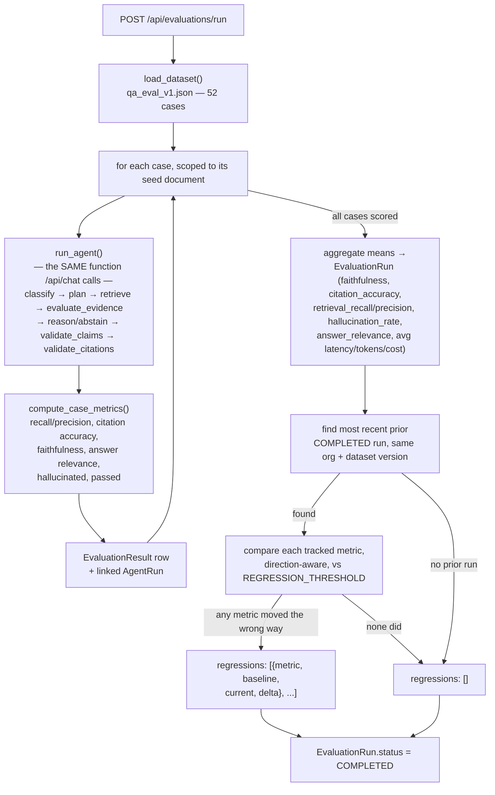
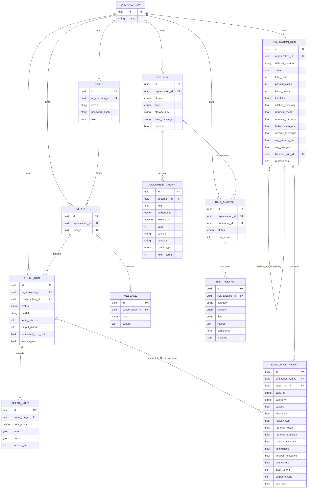
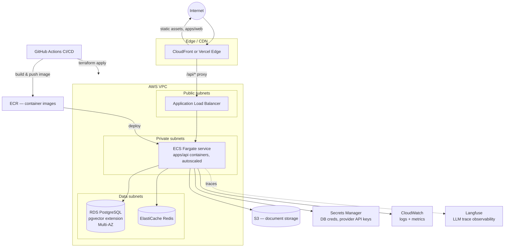

# Architecture

> Status: reflects Phase 1–6 (auth, document pipeline, hybrid RAG, LangGraph agent, risk analysis, document comparison, evaluation harness + regression testing, cost/observability tracking). Diagrams for later phases (production cloud deploy) are marked **target state**. See the roadmap in the root [README](../README.md).

## 1. System overview

ContractLens AI is a monorepo with two independently deployable applications that communicate over HTTP only — no shared runtime, no shared database access from the frontend.

- **`apps/web`** — Next.js 15 (App Router, TypeScript, Tailwind, shadcn/ui, TanStack Query). Renders the dashboard, documents, risk analysis/comparison, AI assistant, agent-run trace viewer, evaluations, and settings screens.
- **`apps/api`** — FastAPI (Python 3.12, async SQLAlchemy). Owns all business logic, persistence, retrieval, and AI orchestration (LangGraph agent).

This split keeps the two deployable independently (web on a static/edge host, API on a container host) and keeps every sensitive operation — document access control, LLM calls, retrieval — server-side.



## 2. Why a monorepo, two apps

A single repo simplifies coordinated changes (e.g., a new API field and the UI that renders it) without cross-repo versioning overhead, while `apps/web` and `apps/api` remain independently buildable, testable, and deployable — there is no runtime coupling between them.

## 3. Backend layering

```
apps/api/app/
├── api/v1/        # HTTP layer: routers (auth, documents, search, chat, conversations, agent_runs, comparisons, health)
├── core/          # config, security, logging, structured errors, middleware
├── db/            # session factory, declarative base, Alembic migrations
├── models/        # SQLAlchemy ORM models (see §6 data model)
├── schemas/       # Pydantic request/response schemas
├── services/      # business logic: auth, document_service, rag_service, agent_service, risk_analysis_service, comparison_service, citations, embeddings, reranking, llm
├── retrieval/     # hybrid retrieval pipeline: vector_search, keyword_search, fusion (RRF)
├── agents/        # LangGraph agent: graph.py, nodes.py, state.py, tools/
├── evaluation/    # eval dataset loader + metrics (dataset.py, metrics.py)
└── observability/ # ObservabilityClient: structured-log (default) + Langfuse
```

Routers depend on services; services depend on models/db — never the reverse. Pydantic schemas are the only types that cross the API boundary; ORM models are never serialized directly.

## 4. Document processing flow



`Document.status` moves through `uploading → processing → parsing → chunking → embedding → indexing → completed | failed` (with a stored `error_message` on failure), which the frontend polls to render live progress. Runs today as an in-process `FastAPI BackgroundTask` — Redis is already in the stack so this can move to a real queue (RQ/Celery/arq) without changing `document_service.process_document()` itself.

## 5. RAG + agent query flow

Query answering is implemented as an explicit-state LangGraph agent (`apps/api/app/agents/graph.py`), not a linear prompt chain, so evidence-sufficiency is a real branch and every step is independently inspectable for the Agent Runs UI.



Each node's input/output, latency, and token usage is recorded as an `AgentStep` row against an `AgentRun`, which is what the `/agent-runs/[id]` trace viewer renders — retrieval, reranking, evidence gating, generation, and citation validation are all visible steps, not a black box.

**Hybrid retrieval** (`app/retrieval/`): pgvector HNSW cosine similarity (semantic) + PostgreSQL full-text search (GIN-indexed `tsvector`, keyword) fused with Reciprocal Rank Fusion (scores live on incomparable scales, so RRF uses rank order only), then reranked by a cross-encoder (`RERANKER_PROVIDER=cohere|mock`).

**Citation grounding**: every answer is built from a numbered evidence block; `validate_citations()` strips any citation marker the model produced that doesn't map to an actually-retrieved chunk before the response reaches the caller.

**Abstention**: the evidence-score gate runs *before* the LLM call (cheaper, faster, removes any chance of rationalizing from weak evidence) and again *after* generation if zero citations survive validation.

## 6. Risk analysis + document comparison flow

Both reuse the same retrieval + citation-validation primitives as chat rather than a separate pipeline:



`app/services/risk_analysis_service.py` runs as a background task per `POST /api/documents/{id}/analyze`, identical in shape to `document_service.process_document()` (its own DB session, polled status). `app/services/comparison_service.py` runs synchronously within `POST /api/comparisons` since it's pure retrieval with no LLM call — see `docs/analysis.md` for why comparison deliberately skips generation.

## 7. Evaluation flow

`POST /api/evaluations/run` (`app/services/evaluation_service.py::run_evaluation`) runs as a background task, identical in shape to document processing and risk analysis: create a `RUNNING` row, do the work with its own DB session, land on `COMPLETED` or `FAILED`. What's different is that "the work" is running the entire agent graph from §5 once per dataset case, not a single pipeline pass.



Each case reuses the real chat pipeline (`run_agent()`) rather than a lighter-weight direct-retrieval check, and produces a real, independently-inspectable `AgentRun` — a failing eval case can be opened in the Agent Runs trace viewer, not just read as a number. See `docs/evaluation.md` for the full metric definitions and the rationale behind reusing the agent, comparing against the most recent run rather than a fixed baseline, and treating `answer_relevance`/`faithfulness` as lexical heuristics for now rather than an LLM-as-judge.

Cost and latency are captured as a side effect of every agent run, not just eval runs: `app/services/cost.py::estimate_cost()` (a small explicit per-model pricing table) is applied to every `AgentRun`'s `input_tokens`/`output_tokens`, and `app/observability/` (`StructuredLogObservability` by default, `LangfuseObservability` when `LANGFUSE_PUBLIC_KEY`/`LANGFUSE_SECRET_KEY` are set) records a trace of model/tokens/cost/latency/step-count for every run, chat or eval alike — see `docs/evaluation.md` for the Langfuse self-hosting scope decision.

## 8. Data model



PostgreSQL is used exclusively through async SQLAlchemy sessions with Alembic-managed migrations. The `vector` extension was enabled from the first migration, before any vector columns existed, so later phases could add `document_chunks.embedding` (HNSW index) and a generated `tsvector`/GIN column without a separate extension-enabling migration. See §8 (rationale) below and `docs/rag.md` for the full case for PostgreSQL+pgvector over a dedicated vector database.

## 9. Multi-tenancy and auth

Every user belongs to an `Organization`. JWTs (HS256, bcrypt-hashed passwords) carry both `sub` (user id) and `org_id`; every authenticated request resolves the current user server-side, and every query for tenant-owned resources (documents, chunks, conversations, agent runs) filters by `organization_id` — no user can address another org's data by ID alone (verified by tests). Full authorization model and planned hardening (rate limiting, audit logs, upload content-sniffing) in `docs/security.md`.

## 10. Provider abstractions

`LLM_PROVIDER`, `EMBEDDING_PROVIDER`, and `RERANKER_PROVIDER` environment variables select between a real provider (OpenAI, Cohere) and a deterministic `mock` implementation, so the full pipeline — upload, retrieval, generation, citation validation, abstention — is exercisable end-to-end with zero API keys (demo mode). Swapping a provider is a config change, not a code change, because each is implemented behind a common interface (`services/llm/`, `services/embeddings/`, `services/reranking/`).

## 11. Local development topology

`docker-compose.yml` runs four services with health checks:

| Service    | Image / build              | Local port | Role                                  |
|------------|-----------------------------|------------|----------------------------------------|
| `postgres` | `pgvector/pgvector:pg16`   | 5433→5432  | Relational + vector store              |
| `redis`    | `redis:7-alpine`           | 6379       | Reserved for queue/cache/rate-limit    |
| `api`      | `apps/api/Dockerfile`      | 8000       | FastAPI, source volume-mounted (`--reload`) |
| `web`      | `apps/web/Dockerfile`      | 3002→3000  | Next.js                                |

This matches the shape of the target production deployment below without requiring cloud credentials for local work.

## 12. Cloud architecture — target state (Phase 8)

`infrastructure/{terraform,docker,aws}` currently hold placeholders — this diagram is the intended production shape referenced throughout the README and this doc, to be implemented as Terraform in Phase 8. It is a design target, not yet-deployed infrastructure.



Design intent:

- **`apps/web`** deploys to an edge/static host (Vercel or CloudFront+S3) — it holds no secrets and talks to the API only over REST.
- **`apps/api`** deploys as containers on ECS Fargate behind an ALB, in private subnets — no direct internet ingress, autoscaled on request volume.
- **RDS PostgreSQL** (Multi-AZ) replaces the local `pgvector/pgvector:pg16` container; pgvector extension enabled the same way via Alembic.
- **ElastiCache Redis** replaces the local Redis container, once it moves from "reserved" to backing a real task queue and rate limiter.
- **S3** replaces the local disk `StorageBackend` — the code path is already provider-agnostic (`STORAGE_BACKEND=local|s3`), so this is a config change, not a rewrite.
- **Secrets Manager** holds DB credentials and LLM/embedding/reranker provider API keys — never baked into images or committed to the repo.
- **CI/CD** (GitHub Actions, `infrastructure/`) builds and pushes container images to ECR and applies Terraform for infra changes.
- **Langfuse** receives LLM/agent traces (cost, latency, token usage per node) — the `LangfuseObservability` integration exists as of Phase 6 (see §7), but this diagram's self-hosted-in-VPC Langfuse is still target state; today it points at Langfuse Cloud or a separately-run instance via `LANGFUSE_HOST`, not infrastructure this repo stands up.

## 13. Trade-offs and known limitations

See the root [README](../README.md#trade-offs-so-far) for the current, maintained list (background processing via in-process `BackgroundTasks` rather than a queue, regex-heuristic chunking, mock embedding/reranker semantics, client-side auth guard, etc.) — kept in one place to avoid this document drifting out of sync with it.

## 14. Related documents

- [`docs/rag.md`](rag.md) — retrieval, chunking, and citation design rationale
- [`docs/agent.md`](agent.md) — LangGraph agent design rationale
- [`docs/security.md`](security.md) — auth and authorization model
- [`docs/evaluation.md`](evaluation.md) — evaluation dataset, metrics, and regression-detection rationale
- [`docs/analysis.md`](analysis.md) — risk analysis and document comparison design rationale
